<div align="center">

# GaitLogic Planner

### 跑者的训练计划、训练日志、配速计算与复盘工作台

从训练计划到每日执行，从 AI 草稿到 Excel 导入，从 VDOT 配速到训练日历，GaitLogic Planner 希望把跑者分散在表格、手表、聊天记录和笔记里的训练信息，整理成一个可维护、可复盘、可继续推进的系统。

**Plan smarter. Run calmer. Review honestly.**

<p>
  <a href="docs/更新历史.md"></a>
  
  
  
  
  
</p>

<p>
  <a href="README-EN.md">English</a> ·
  <a href="#-一屏看懂">一屏看懂</a> ·
  <a href="#-核心特性">核心特性</a> ·
  <a href="#-界面预览">界面预览</a> ·
  <a href="#-快速开始">快速开始</a> ·
  <a href="#-导航">导航</a> ·
  <a href="#-科学设计与训练安全">科学设计与训练安全</a> ·
  <a href="#-功能详解">功能详解</a> ·
  <a href="#-项目边界">项目边界</a> ·
  <a href="#-开源治理">开源治理</a>
</p>

</div>

---

## 🧭 一屏看懂

GaitLogic Planner 不是一个简单的跑步打卡工具。它更关注训练管理闭环：

```text
制定计划 -> 执行训练 -> 填写日志 -> 查看统计 -> 复盘调整 -> 继续训练
```

AI 生成内容仅作为训练计划草稿，不构成医疗建议、康复建议或专业教练处方。请结合自身恢复、伤病情况、天气、地形和实际训练反馈调整。

| 你可能正在遇到的问题 | GaitLogic Planner 的处理方式 |
| --- | --- |
| 训练计划在 Excel，执行记录在手表，复盘在聊天记录里 | 用训练周期、训练块、每日计划、日志和统计把数据收束到一个系统 |
| 新用户一打开就被复杂 Dashboard 淹没 | 登录后默认进入“今日训练”，移动端使用底部导航 |
| 想用 AI 生成课表，但不希望它直接覆盖正式计划 | AI 只生成草稿，必须由用户确认后才应用 |
| 想看一个月到底完成了哪些训练 | 训练日历按月展示计划、状态、今天高亮和完成统计 |
| 每周训练结束后不知道如何调整下一周 | 后端确定性统计与规则引擎先判断，AI 只生成调整草稿，用户确认后才应用 |
| 配速区间靠经验记忆，不好维护 | 根据比赛成绩估算近似 VDOT，并保存配速档案和规则 |
| 年龄和性别会不会影响训练配速 | 年龄/性别只做参考分析，不改变原始 VDOT 和训练配速 |

---

## 🧩 徽章矩阵

| 类型 | 状态 |
| --- | --- |
| Frontend |     |
| Backend |    |
| Data |   |
| AI |   |
| Quality |   |

---

## ✨ 核心特性

| 日常使用 | 计划管理 | 分析复盘 | AI 与后台 |
| --- | --- | --- | --- |
| 🏠 今日训练 | 📋 我的训练计划 | 📅 训练日历 | 🧠 AI 制定计划 |
| ✍️ 训练日志 | 🧱 训练周期 | 📊 训练统计 | 📤 AI 草稿导出 |
| 📝 智能周复盘 | 🧭 负荷与恢复 | ✅ 用户确认后应用 | 🛡 通用安全校验 |
| 📱 移动端底部导航 | 🧩 训练块 | 🧮 配速计算器 | ⚙️ AI 教练偏好 |
| ↩️ 我的页返回路径 | 📥 Excel 导入 | 🎂 年龄参考分析 | 🛠 管理后台 |
| 🧾 内测反馈 | 🏷 配速规则 | 📈 完成率与跑量趋势 | 🔑 模型配置 |

---

## 🖼 界面预览

### 移动端默认路径

<p align="center">
  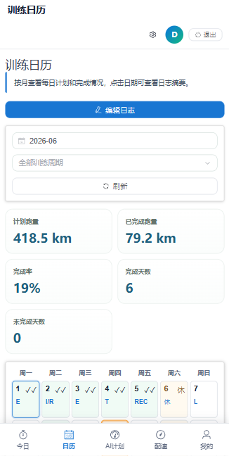
</p>

宽度 `<= 768px` 时隐藏侧边栏，改用底部导航：

```text
今日 / 日历 / AI计划 / 配速 / 我的
```

### 桌面端工作台

<p align="center">
  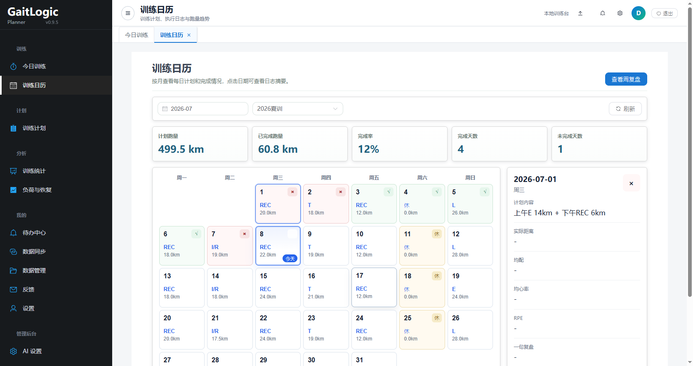
</p>

### 训练日历

<p align="center">
  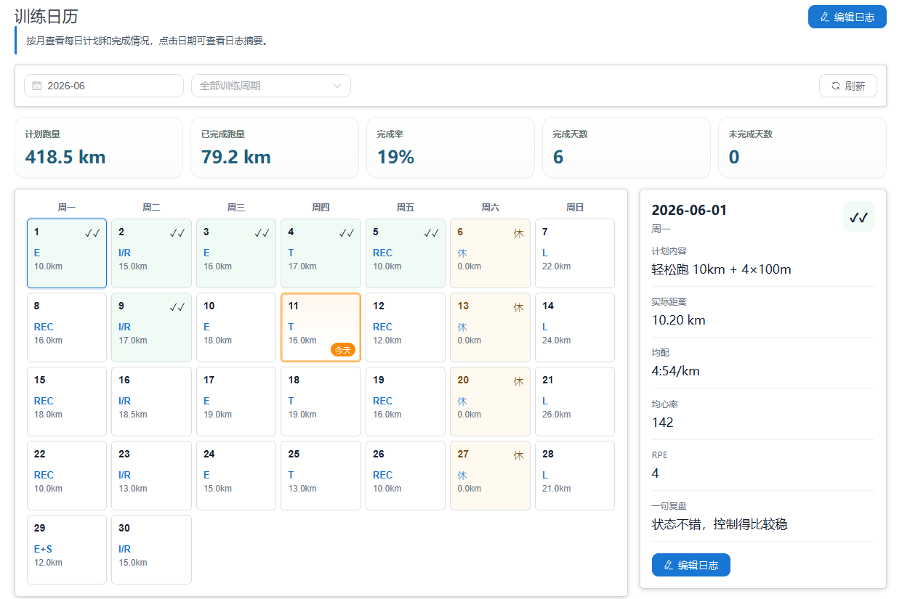
</p>

### AI 制定计划

<p align="center">
  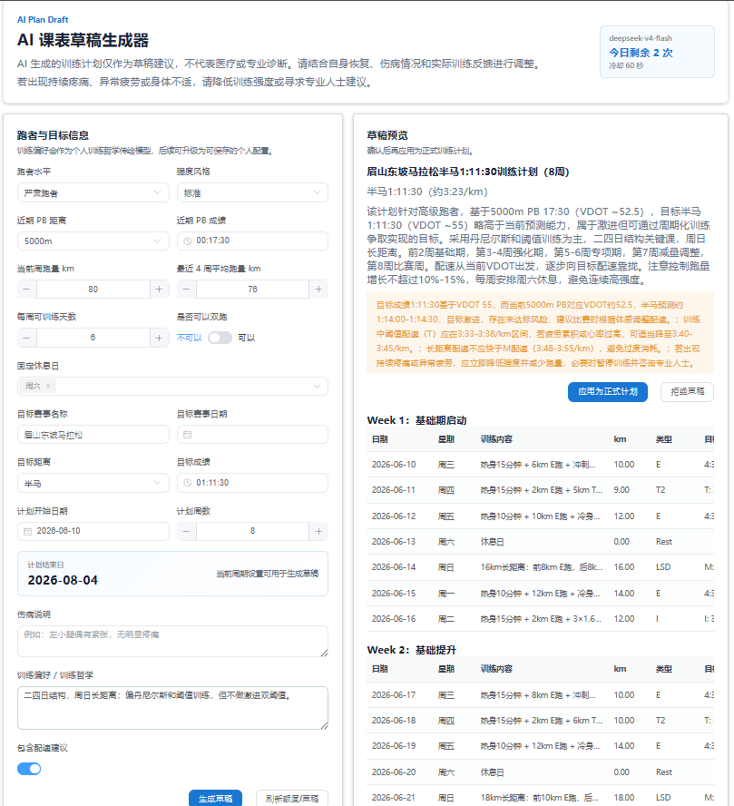
</p>

### VDOT 配速计算器

<p align="center">
  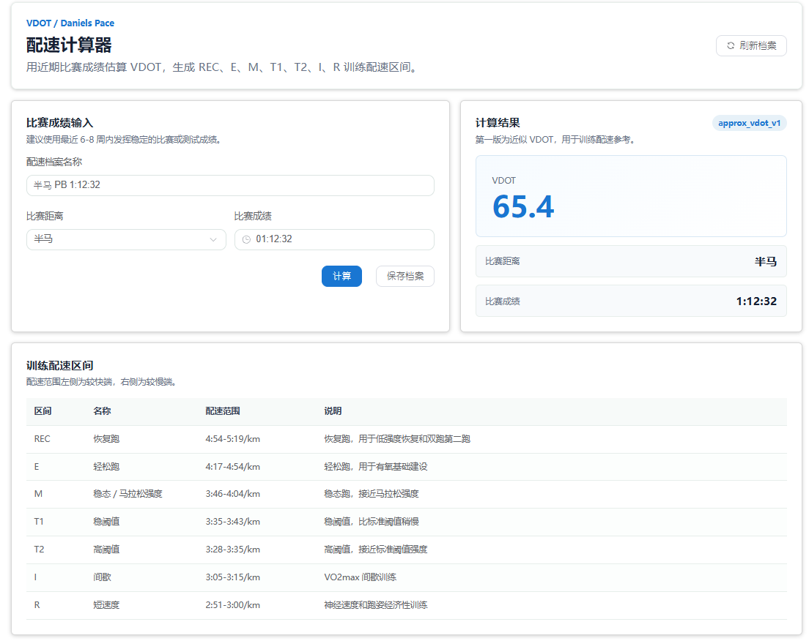
</p>

---

## 🚀 快速开始

### 1. 准备后端

```bash
python -m pip install -e .
python scripts/init_db.py
uvicorn server.main:app --reload
```

接口文档：

```text
http://127.0.0.1:8000/docs
```

### 2. 准备前端

```bash
cd web
npm install
npm run dev
```

### 3. 配置环境变量

示例：

```env
MYSQL_HOST=127.0.0.1
MYSQL_PORT=3306
MYSQL_USER=root
MYSQL_PASSWORD=your_password
MYSQL_DATABASE=gaitlogic_planner

JWT_SECRET_KEY=please-change-this-to-a-long-random-secret
ACCESS_TOKEN_EXPIRE_DAYS=7

AI_API_KEY=your_api_key
AI_BASE_URL=https://api.deepseek.com
AI_MODEL=deepseek-v4-flash
AI_TIMEOUT_SECONDS=120

AI_PLAN_DAILY_LIMIT=3
AI_PLAN_COOLDOWN_SECONDS=60

TRAINING_READINESS_ROLLOUT_MODE=off
AI_READINESS_EXPLANATION_ENABLED=false
```

兼容旧配置：

```env
DEEPSEEK_API_KEY=your_api_key
DEEPSEEK_BASE_URL=https://api.deepseek.com
DEEPSEEK_MODEL=deepseek-v4-flash
DEEPSEEK_TIMEOUT_SECONDS=120
```

---

## 📚 导航

- [一屏看懂](#-一屏看懂)
- [核心特性](#-核心特性)
- [界面预览](#-界面预览)
- [快速开始](#-快速开始)
- [系统架构](#-系统架构)
- [科学设计与训练安全](#-科学设计与训练安全)
- [功能详解](#-功能详解)

- **使用与开发文档**
  - [完整文档中心](docs/README.md)
  - [负荷与恢复使用指南](docs/user/training-readiness-guide.md)
  - [训练负荷与恢复实现说明](docs/development/training-load-recovery-implementation.md)
  - [后端学习指南](md/BACKEND_LEARNING_GUIDE.md)
  - [数据库设计](md/数据库设计.md)
  - [Excel 字段映射](md/Excel字段映射.md)
  - [周复盘 API](docs/API_WEEKLY_REVIEW.md)

- **科学设计与训练安全**
  - [科学文档索引](docs/science/README.md)
  - [科学证据与产品边界](docs/science/fatigue-management-evidence.md)
  - [训练负荷与恢复指标定义](docs/science/fatigue-indicator-definition.md)
  - [训练状态决策规则 v1](docs/science/fatigue-decision-rules-v1.md)

- **部署与架构**
  - [部署说明](docs/DEPLOYMENT.md)
  - [一键重新部署](docs/REDEPLOY.md)
  - [Noomi 迁移文档索引](gaitlogic-noomi/docs/migration/README.md)

- **开源与项目治理**
  - [开源与项目治理规则](OPEN_SOURCE_POLICY.md)
  - [贡献指南](CONTRIBUTING.md)
  - [安全策略](SECURITY.md)
  - [商标使用说明](TRADEMARK.md)

- **项目进展**
  - [开发路线](docs/开发路线.md)
  - [版本记录](CHANGELOG.md)
  - [详细更新历史](docs/更新历史.md)

---

## 🏗 系统架构

GaitLogic Planner 采用前后端分离架构：

- 前端：Vue 3、TypeScript、Vite、Element Plus、ECharts；
- 后端：FastAPI、SQLAlchemy 2.x、MySQL 8.0+；
- Excel：openpyxl；
- AI：OpenAI-compatible SDK；
- 部署：Nginx 反向代理前端静态资源和后端 API。

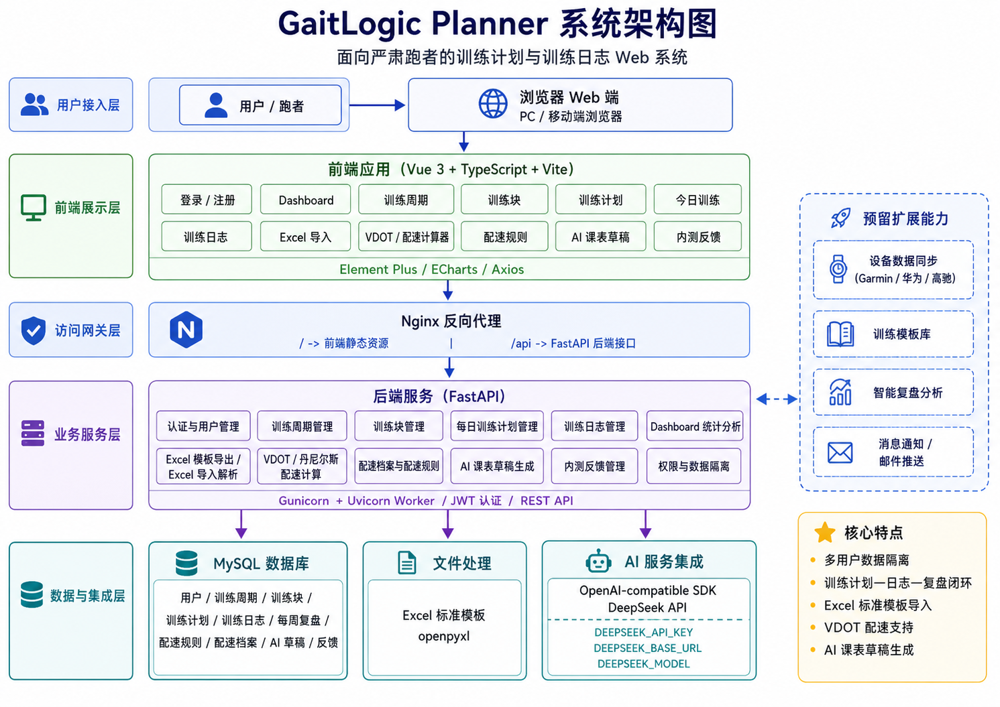

```text
GaitLogic Planner
├── web/                 # Vue 3 + Vite + Element Plus
├── server/              # FastAPI API layer
├── planner_core/        # SQLAlchemy models, config, enums
├── scripts/             # 初始化与辅助脚本
├── tests/               # pytest 测试
├── sql/                 # MySQL schema
└── docs/                # 文档、截图、更新历史
```

---

## 🧰 技术栈

| 层级 | 技术 |
| --- | --- |
| 前端 | Vue 3、TypeScript、Vite、Element Plus、ECharts、Axios |
| 后端 | FastAPI、SQLAlchemy 2.x、MySQL 8.0+、PyMySQL、Pydantic 2.x、pydantic-settings |
| Excel | openpyxl |
| AI | OpenAI-compatible SDK |
| 测试 | pytest |
| 部署 | Gunicorn、Uvicorn Worker、Nginx |

---

## 🔬 科学设计与训练安全

GaitLogic 的训练负荷与恢复管理采用外部负荷、内部负荷、恢复状态、表现变化以及疼痛与异常症状相结合的监测框架。

v0.9.0 新增基础版“负荷与恢复”闭环：恢复打卡、session-RPE、最近 7 天滚动负荷、过去 28 天个人基线、四档训练状态和模板化建议。系统不输出疲劳总分、伤病概率或医疗诊断，所有计划调整仍需用户确认。

相关文档：

- [负荷与恢复使用指南](docs/user/training-readiness-guide.md)
- [训练负荷与恢复实现说明](docs/development/training-load-recovery-implementation.md)
- [科学证据与产品边界](docs/science/fatigue-management-evidence.md)
- [训练负荷与恢复指标定义](docs/science/fatigue-indicator-definition.md)
- [训练状态决策规则 v1](docs/science/fatigue-decision-rules-v1.md)

该功能用于训练管理和趋势参考，不用于医疗诊断、伤病概率预测或过度训练综合征诊断。AI 不能未经用户确认修改正式训练计划。

---

## 🧠 推荐使用流程

### 新用户最短路径

```text
注册并登录
  ↓
进入今日训练
  ↓
通过 AI 制定计划，或导入 Excel 训练计划
  ↓
训练完成后填写日志
  ↓
在训练日历和训练统计中查看完成情况
```

### 完整训练管理路径

```text
创建训练周期
  ↓
创建训练块
  ↓
添加每日训练计划
  ↓
每日查看今日训练 / 训练日历
  ↓
训练完成后填写训练日志
  ↓
查看训练统计
  ↓
使用配速计算器更新配速规则
  ↓
根据复盘继续调整计划
```

---

## 🗺 导航结构

<details open>
<summary><strong>桌面端侧边栏</strong></summary>

```text
常用
├── 今日训练
└── 训练日历

计划
├── AI 制定计划
├── 我的训练计划
└── 配速计算器

更多
├── 训练统计
├── 负荷与恢复
├── Excel 导入
└── 反馈

高级设置（默认折叠）
├── AI 教练偏好
├── 训练周期
├── 训练块
└── 配速规则

管理后台（仅 admin 可见）
└── AI 设置
```

</details>

<details open>
<summary><strong>移动端底部导航</strong></summary>

```text
今日 / 日历 / AI计划 / 配速 / 我的
```

“我的”页面提供移动端聚合入口：

- 我的训练计划；
- 训练统计；
- 负荷与恢复；
- Excel 导入；
- 反馈；
- 高级设置入口。

从“我的”进入二级页面时，内容区会出现返回“我的”的左箭头。

</details>

---

## 📦 功能概览

| 模块 | 说明 |
| --- | --- |
| 账号系统 | 注册、登录、JWT 认证、用户数据隔离 |
| 今日训练 | 登录后默认进入，快速查看当天训练并填写日志 |
| 训练日历 | 月历视图展示每日计划、完成状态和本月统计 |
| 我的训练计划 | 维护每日训练安排，移动端使用卡片列表 |
| 训练日志 | 记录实际距离、配速、心率、RPE、体感和复盘 |
| 训练统计 | 查看跑量、完成率、训练类型分布和趋势 |
| Excel 导入 | 下载标准模板，批量导入训练周期、计划和日志 |
| 配速计算器 | 根据比赛成绩估算 VDOT 和训练配速区间 |
| 年龄/性别参考 | 在配速计算器中记录年龄/性别，仅用于表现参考说明 |
| 配速规则 | 保存 REC、E、M、T1、T2、I、R 等训练配速规则 |
| AI 制定计划 | 基于用户输入生成训练计划草稿，确认后再应用 |
| AI 教练偏好 | 配置训练偏好，影响 AI 草稿生成倾向 |
| 内测反馈 | 提交问题、建议和训练逻辑反馈 |
| 后台管理 | 管理用户、系统入口和 AI 模型配置 |

---

## 📘 功能详解

<details open>
<summary><strong>登录与注册</strong></summary>

用户首次使用需要注册账号。系统会为每个用户创建独立数据空间，不同用户之间的训练周期、训练计划、训练日志、配速规则和 AI 草稿互相隔离。


登录成功后，前端会保存认证状态，并在后续请求中自动携带 Token。后端根据当前登录用户绑定数据，前端不需要手动传递 `user_id`。

</details>

<details open>
<summary><strong>今日训练</strong></summary>

今日训练是普通用户的默认首页。


它适合每天训练前查看：

- 今天是否有训练；
- 计划训练类型和距离；
- 训练内容如何执行；
- 当前日志完成状态；
- 训练后快速填写日志。

首页也会在新用户没有训练周期时显示首次使用指引，提供 AI 制定计划和 Excel 导入入口。

</details>

<details open>
<summary><strong>训练日历</strong></summary>

训练日历以月历形式展示每日计划和完成状态。


每天会显示：

- 日期；
- 主训练类型；
- 计划距离；
- 完成状态标记；
- 今天高亮标记。

状态标记：

| 状态 | 标记 |
| --- | --- |
| completed_high | `✓✓` |
| completed_normal | `✓` |
| completed_adjusted | `△` |
| missed | `×` |
| rest | `休` |
| not_started | 空 |

页面顶部展示本月统计：

- 计划跑量；
- 已完成跑量；
- 完成率；
- 完成天数；
- 未完成天数。

点击某一天可以查看计划内容、实际距离、均配、均心率、RPE、一句复盘，并跳转编辑日志。

</details>

<details open>
<summary><strong>我的训练计划与训练日志</strong></summary>

我的训练计划用于维护每天应该完成的训练内容。

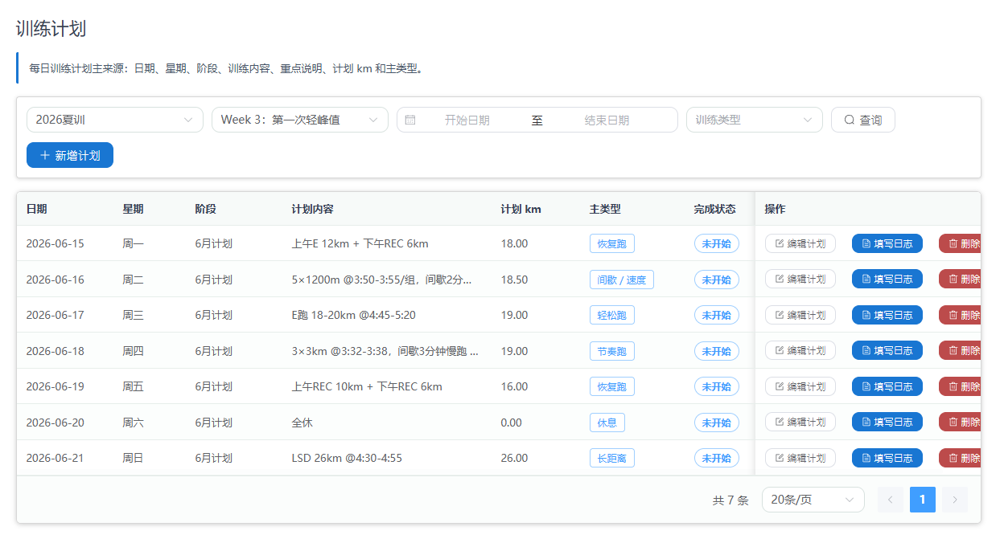

一条计划通常包括：

- 日期；
- 所属训练周期；
- 所属训练块；
- 训练类型；
- 计划距离；
- 训练内容；
- 重点说明。

移动端不使用宽表格，改为卡片列表，方便查看和操作。

训练完成后，用户可以填写训练日志，用于记录实际完成情况并和原计划对比。

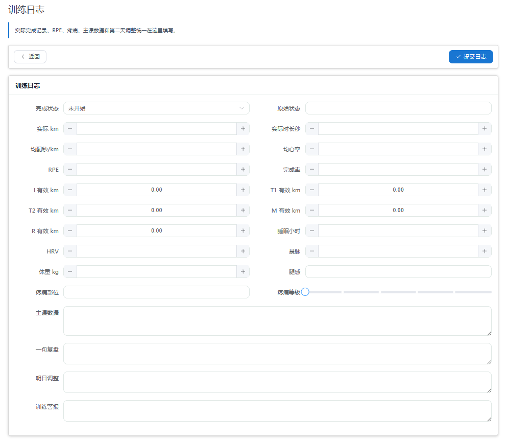

基础字段默认展示：

- 完成状态；
- 实际距离；
- 实际时长；
- 平均配速；
- 平均心率；
- RPE；
- 主课数据；
- 一句复盘。

高级字段折叠展示：

- 有效公里；
- 睡眠、HRV、晨脉、体重；
- 腿感和疼痛；
- 明日调整；
- 训练警报。

</details>

<details open>
<summary><strong>训练统计</strong></summary>

训练统计用于查看训练数据概览，帮助用户快速了解近期训练状态。

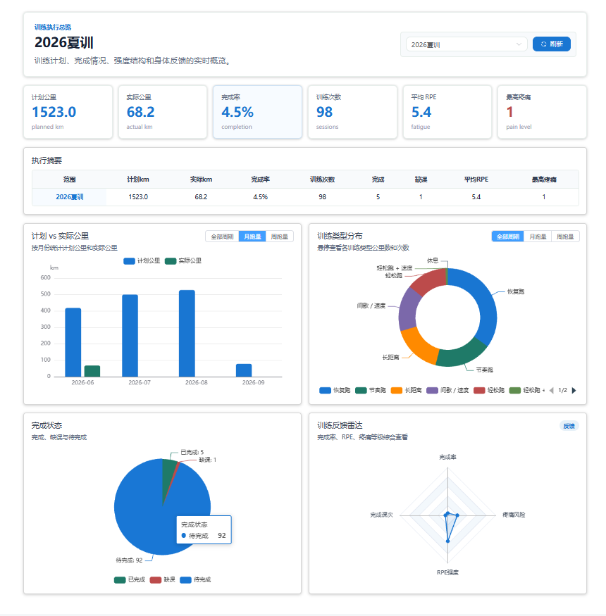

主要关注：

- 最近跑了多少；
- 计划完成率怎么样；
- 不同训练类型比例是否合理；
- 当前训练周期跑量趋势；
- 是否存在训练堆积或长期缺课。

</details>

<details open>
<summary><strong>训练周期与训练块</strong></summary>

训练周期是最高层级的训练结构，适合管理一个完整备赛阶段，例如夏训、校运会周期、半马周期或马拉松周期。

训练块是训练周期下的阶段划分：

```text
2026 夏训周期
├── 基础有氧块
├── 阈值提升块
├── 专项强化块
└── 减量调整块
```

这些能力被归入高级设置，避免干扰普通用户的日常路径。

</details>

<details open>
<summary><strong>Excel 标准模板导入</strong></summary>

系统支持通过标准 Excel 模板批量导入训练数据。

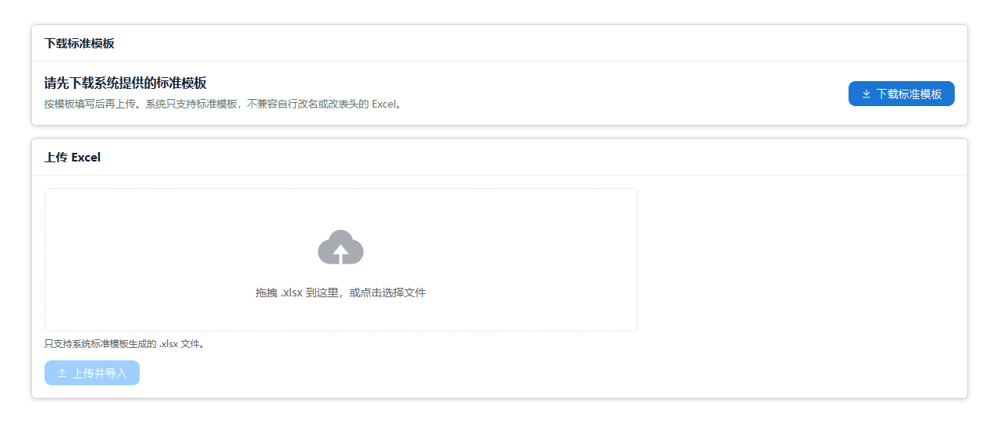

适合：

- 已经在 Excel 中写好了完整训练计划；
- 想批量导入训练周期、训练块、每日计划和日志；
- 想从线下表格迁移到系统中管理。

注意：系统只支持后端生成的标准 Excel 模板，不兼容任意非标准 Excel。请不要随意修改模板 Sheet 名称、表头字段和字段顺序。

</details>

<details open>
<summary><strong>配速计算器、年龄参考与配速规则</strong></summary>

系统内置 VDOT / 丹尼尔斯配速计算器，用于根据比赛成绩估算训练配速区间。


用户输入比赛距离和比赛成绩后，系统会估算：

- 近似 VDOT；
- REC 恢复跑配速；
- E 有氧跑配速；
- M 马拉松配速；
- T1 / T2 阈值配速；
- I 间歇配速；
- R 重复跑配速。

配速建议用于训练参考，不代表必须严格执行。疲劳、天气、地形和身体状态都会影响实际配速。

年龄 / 性别参考分析支持填写：

- 年龄；
- 性别：`male` / `female` / `unknown`。

当前训练配速仍然基于实际比赛成绩推算。年龄和性别仅用于表现水平参考，不会直接替代当前训练能力，也不会覆盖原始 VDOT。

系统会在“年龄参考分析”中单独展示年龄等级、公开组等效成绩、年龄系数和参考标签。该结果仅用于横向表现水平参考，不会混入训练配速区间。

配速规则用于保存当前账号的训练配速体系。

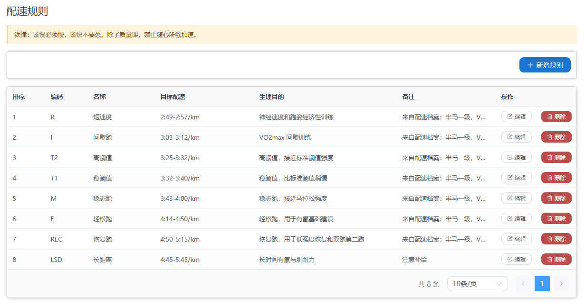

示例：

| 类型 | 含义 | 示例 |
| --- | --- | --- |
| REC | 恢复跑 | 5:10-5:50/km |
| E | 有氧跑 | 4:35-5:05/km |
| M | 马拉松配速 | 3:55-4:05/km |
| T1 | 低阈值 | 3:38-3:45/km |
| T2 | 高阈值 | 3:30-3:36/km |
| I | 间歇 | 3:12-3:20/km |
| R | 重复跑 | 68-75s/400m |

用户可以将某一次 VDOT 计算结果保存为配速档案，并一键应用到当前账号的配速规则中。

</details>

<details open>
<summary><strong>AI 制定计划、草稿导出与 AI 教练偏好</strong></summary>

AI 制定计划用于根据用户输入的跑者信息生成结构化训练计划草稿。

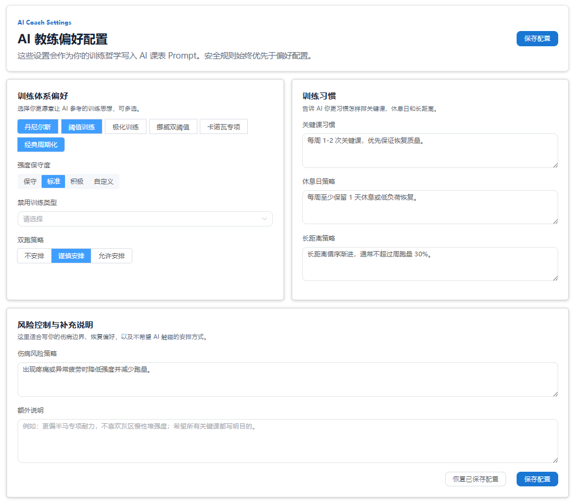


用户通常需要填写：

- 当前跑量；
- 近期 PB；
- 目标赛事；
- 目标成绩；
- 每周可训练天数；
- 计划周数；
- 当前训练水平；
- 强度风格；
- 训练偏好；
- 伤病或限制说明。

AI 不会直接覆盖正式计划。系统采用两步流程：

```text
生成 AI 草稿
  ↓
用户检查与确认
  ↓
点击“应用为正式计划”
  ↓
写入训练周期、训练块、每日训练计划和默认训练日志
```

默认规则：

- 每个用户每天最多生成 3 次；
- 同一用户两次生成至少间隔 60 秒；
- 24 小时内相同输入优先命中缓存；
- 草稿、调用记录和额度按当前登录用户隔离。

AI 草稿生成后可以导出为多种文件：

- Excel 工作簿；
- CSV 表格；
- Markdown 文档；
- JSON 数据；
- 日历 ICS；
- Garmin / 高驰参考 CSV。

其中 Garmin / 高驰参考 CSV 仅用于手动录入或二次转换，不会直连设备账号，也不代表官方本地课表导入格式。

</details>

<details open>
<summary><strong>后台管理</strong></summary>

后台管理仅 `role = admin` 用户可见。

当前包含：

- 用户管理：查看用户、编辑角色、启用/停用用户；
- 系统设置：集中展示管理入口和系统范围说明；
- AI 设置：配置模型服务、API Key、生成额度和调用参数。

AI 设置支持 OpenAI-compatible 模型接口：

- DeepSeek 仍作为默认预设；
- 可填写任意兼容服务的 Base URL；
- 可自定义模型名；
- 可调整 temperature、top_p、timeout、max_tokens 和每日额度。

</details>

<details open>
<summary><strong>内测反馈</strong></summary>

系统提供内测反馈功能，方便用户提交问题和建议。

可反馈内容：

- 页面 Bug；
- 数据异常；
- Excel 导入问题；
- AI 生成结果问题；
- 功能建议；
- 交互体验问题；
- 训练逻辑建议。

</details>

---

## ✅ 测试

后端：

```bash
python -m compileall -q planner_core server scripts tests
python -m pytest -q
```

前端：

```bash
cd web
npm run build
```

数据库测试只使用 MySQL。如果当前环境无法连接 MySQL，相关集成测试会跳过，不会切换到 SQLite。

---

## 🚧 项目边界

当前项目范围聚焦训练计划和训练日志相关能力：

- 训练计划制定与维护；
- 每日训练日志填写；
- 训练日历与完成状态可视化；
- 训练统计与复盘；
- 配速计算与配速规则；
- Excel 标准模板导入；
- AI 训练计划草稿；
- 管理后台基础配置。

明确不做：

- 不接 Garmin / 高驰账号直连；
- 不做 App / 小程序；
- 不做广告系统；
- 不做付费系统；
- 不做社交功能；
- 不让 AI 直接覆盖正式计划；
- 不伪造年龄分级或训练能力修正。

---

## 🧠 开发原则

- 不让 AI 直接覆盖正式计划；
- 不伪造年龄分级或训练能力修正；
- 不把高级功能堆到普通用户默认路径；
- 优先保证训练计划、训练日志、复盘统计的稳定性；
- 数据库结构优先兼容后续 Excel 导入、网页制定计划、训练日志填写、统计复盘和设备同步扩展。

---

## 👐 开源治理

### 开源许可证

当前仓库根目录尚未提供 `LICENSE` 文件，因此项目最终开源许可证尚未完成确认。

维护者正在评估使用 `AGPL-3.0-only`。在正式 `LICENSE` 文件加入仓库前，请不要将 README 或其他文档中的说明理解为已经完成许可证授权。

如果未来采用 AGPL-3.0-only，网络服务形式分发修改版时，需要按许可证要求向相应用户提供源代码。最终规则以根目录 `LICENSE` 文件为准。

### 开源范围

社区版聚焦当前已经在仓库中实现的训练管理能力：

- 登录注册与用户数据隔离；
- 训练周期、训练块、每日训练计划、今日训练、训练日历和训练日志；
- Excel 标准模板下载与导入；
- Dashboard / 训练统计；
- 配速计算器和配速规则；
- AI 课表草稿生成、预览、确认应用和 AI 教练偏好；
- 反馈收集和基础管理后台；
- 本地部署、测试和公开 API 数据结构。

不属于社区仓库必须公开的内容包括生产密钥、真实用户数据、官方云服务风控策略、私有训练模板库、生产环境完整 Prompt、支付系统和受第三方协议限制的设备商业接口。

详细规则见 [OPEN_SOURCE_POLICY.md](OPEN_SOURCE_POLICY.md)。

### 贡献入口

欢迎提交 Bug 修复、测试、文档、移动端体验、数据导入导出和合理的训练统计改进。

开始贡献前请阅读 [CONTRIBUTING.md](CONTRIBUTING.md)。提交 Issue 或 Pull Request 时，不要包含真实用户数据、密钥、Token、数据库备份或未脱敏日志。

### 安全报告入口

安全问题请不要直接公开完整利用细节。请优先使用仓库平台提供的私密安全报告功能，例如 GitHub Security Advisories / Private vulnerability reporting。

当前项目尚未提供公开安全邮箱。详细说明见 [SECURITY.md](SECURITY.md)。

### 社区版与未来官方服务的边界

GaitLogic Planner Community 是可独立运行的开源社区版。未来可能存在的 GaitLogic Cloud、GaitLogic Coach Engine 或其他官方托管服务，可能包含运维、成本控制、私有训练模板、增强 Prompt、商业支持和品牌服务。

代码许可证不自动授予 GaitLogic 名称和 Logo 使用权。Fork 或二次发行版本应使用可区分名称，不得冒充官方版本。详细规则见 [TRADEMARK.md](TRADEMARK.md)。

---

## 📝 更新历史

详细版本记录见：[更新历史](docs/更新历史.md)。

---

## 🐣 说明

GaitLogic Planner 仍处于持续开发阶段，当前版本更偏向个人训练管理和内测使用。

如果你也是跑者、教练、体育科技开发者，或者对“跑步 + 软件系统 + AI 辅助训练”感兴趣，欢迎提出建议、提交 issue 或参与改进。
