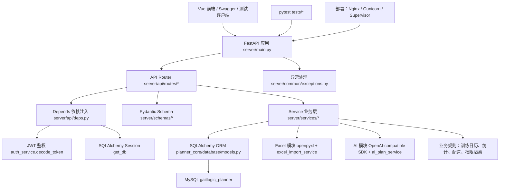

# GaitLogic Planner 后端学习指南

这份文档不是官方说明书，而是一份后端学习路线和项目代码导读。

目标读者：已经会前端，会一点 Python 或 Java，想用一个真实项目系统补后端能力的人。你不需要一上来理解所有代码，但需要按顺序把请求链路、数据库、鉴权、业务层、测试和部署串起来。

---

## 1. 为什么用这个项目学后端

GaitLogic Planner 很适合作为后端学习材料，因为它不是演示用的 Todo App，而是一个业务边界清楚、功能足够完整的训练计划系统。

它适合学习后端的原因：

- 业务真实：核心业务围绕训练周期、训练块、每日训练计划、训练日志、训练日历、配速规则和统计复盘展开，不是孤立的 CRUD。
- 有用户系统：包含注册、登录、JWT、当前用户识别、用户状态、普通用户和 admin 角色。
- 有数据库：使用 MySQL 8.0+，通过 SQLAlchemy 2.x ORM 映射真实表结构。
- 有 API：FastAPI 按模块拆分路由，接口路径统一挂在 `/api` 下。
- 有 Excel 导入：后端生成标准模板，读取 `.xlsx`，校验 Sheet 和表头，解析训练数据并批量写入。
- 有 AI 调用：使用 OpenAI-compatible SDK 调模型，支持 DeepSeek 作为默认配置，同时保存调用记录、草稿、限流和缓存。
- 有部署：文档里包含 Nginx、Gunicorn、Uvicorn Worker、Supervisor、环境变量和线上排查思路。
- 有权限和数据隔离：绝大部分业务查询都带 `user_id` 条件，接口不相信前端传来的用户身份。
- 有统计和业务规则：训练日历、Dashboard、完成率、配速区间、年龄参考、AI 输出校验都体现了业务逻辑。

你可以用它练到后端开发里最关键的几件事：把需求落成数据结构，把数据结构落成接口，把接口做成可测试、可部署、可维护的系统。

---

## 2. 这个项目的后端全景图

后端主线可以理解为：

```text
前端发请求
  -> FastAPI router 接住请求
  -> Depends 注入数据库 Session 和当前用户
  -> Pydantic Schema 校验请求/组织响应
  -> Service 执行业务逻辑
  -> SQLAlchemy ORM 查询或写入 MySQL
  -> 返回 Schema 给前端
```

整体架构图：



几个关键点：

- `server/main.py` 创建 FastAPI app，注册中间件、异常处理器和所有 router。
- `server/api/routes/` 是 HTTP 层，只应该负责接参数、拿当前用户、调用 service、返回结果。
- `server/schemas/` 是接口数据形状，定义请求 DTO 和响应 DTO。
- `server/services/` 是业务层，负责判断、查询、创建、更新、事务提交。
- `planner_core/database/models.py` 是 ORM 层，对应 MySQL 表。
- `planner_core/database/session.py` 创建数据库 engine 和 Session。
- `server/api/deps.py` 负责依赖注入，包括 `get_db` 和 `get_current_user`。
- Excel 和 AI 都不是直接写在 router 里，而是封装在 service 中。

---

## 3. 后端目录导读

### planner_core/

它负责什么：

- 放后端核心基础设施：配置、数据库连接、ORM 模型、枚举、Excel 解析工具。
- 这是项目里最接近“底座”的目录，`server/` 依赖它。

初学者先看：

- `planner_core/config.py`
- `planner_core/database/base.py`
- `planner_core/database/session.py`
- `planner_core/database/models.py`
- `planner_core/enums.py`
- `planner_core/utils/excel_parse.py`

看代码时带着这些问题：

- 环境变量是怎么变成数据库连接字符串的？
- SQLAlchemy 的 `Base`、`Mapped`、`mapped_column` 分别做什么？
- ORM 模型和 `sql/schema.sql` 里的表如何对应？
- 为什么状态和训练类型要做成枚举？
- Excel 里的日期、配速、时长、状态如何被解析成后端字段？

### server/main.py

它负责什么：

- 创建 FastAPI 应用。
- 注册 CORS。
- 注册统一异常处理器。
- 把各个模块 router 挂到 `/api` 前缀下。
- 提供线上可通过代理访问的 `/api/docs` 和 `/api/openapi.json`。

初学者先看：

- `create_app()`
- `app.include_router(...)`
- `app.add_exception_handler(...)`

看代码时带着这些问题：

- 一个 FastAPI 应用是在哪里创建的？
- 路由为什么在这里统一挂载？
- 为什么业务接口都带 `/api`？
- Swagger 文档为什么本地可以访问 `/docs`，线上推荐访问 `/api/docs`？

### server/routers/

当前项目实际目录是 `server/api/routes/`，可以把它理解成 routers。

它负责什么：

- 每个文件对应一个业务模块的 HTTP 接口。
- 定义 URL、HTTP 方法、请求参数、响应模型和依赖注入。

初学者先看：

- `server/api/routes/health.py`
- `server/api/routes/auth.py`
- `server/api/routes/planned_workouts.py`
- `server/api/routes/workout_logs.py`
- `server/api/routes/training_calendar.py`
- `server/api/routes/excel.py`
- `server/api/routes/ai_plan.py`

看代码时带着这些问题：

- `@router.get`、`@router.post`、`@router.put`、`@router.delete` 分别对应什么？
- 路径参数、查询参数、请求体分别怎么写？
- `response_model` 有什么作用？
- `Depends(get_db)` 和 `Depends(get_current_user)` 分别注入了什么？
- router 有没有直接写复杂业务逻辑？如果没有，它把活交给了哪个 service？

### server/schemas/

它负责什么：

- 定义接口请求和响应的数据结构。
- 用 Pydantic 做类型校验、字段约束和序列化。

初学者先看：

- `server/schemas/auth.py`
- `server/schemas/planned_workout.py`
- `server/schemas/workout_log.py`
- `server/schemas/training_calendar.py`
- `server/schemas/ai_plan.py`
- `server/schemas/excel_import.py`

看代码时带着这些问题：

- Create、Update、Read Schema 为什么要分开？
- 哪些字段允许前端传，哪些字段只能后端生成？
- 为什么响应模型不直接使用 ORM class？
- 枚举、日期、Decimal 这些类型返回给前端时会变成什么？

### server/services/

它负责什么：

- 放业务逻辑。
- 查询数据库。
- 校验业务规则。
- 创建、更新、删除 ORM 对象。
- 控制事务提交和回滚。
- 对接 Excel、AI、统计、配速等复杂功能。

初学者先看：

- `server/services/training_cycle_service.py`
- `server/services/planned_workout_service.py`
- `server/services/workout_log_service.py`
- `server/services/training_calendar_service.py`
- `server/services/auth_service.py`

再看复杂模块：

- `server/services/excel_import_service.py`
- `server/services/ai_plan_service.py`
- `server/services/dashboard_service.py`
- `server/services/pace_calculator_service.py`

看代码时带着这些问题：

- 哪些函数只查询，哪些函数会写数据库？
- 每个查询是否都带了 `user_id`？
- 什么时候 `db.add`，什么时候 `db.flush`，什么时候 `db.commit`？
- 出错时抛的是普通异常，还是项目自定义异常？
- 一个复杂功能是如何拆成多个小函数的？

### scripts/

它负责什么：

- 放命令行脚本和部署辅助脚本。
- 用于初始化数据库、写入演示数据、历史升级、本地启动、一键重新部署。

初学者先看：

- `scripts/init_db.py`
- `scripts/seed_demo.py`
- `scripts/start_backend.ps1`
- `scripts/deploy.ps1`

看代码时带着这些问题：

- `init_db.py` 如何创建数据库？
- `Base.metadata.create_all(bind=engine)` 会根据什么创建表？
- 脚本为什么要手动把项目根目录加入 `sys.path`？
- 本地启动和生产部署有什么区别？

### tests/

它负责什么：

- 用 pytest 验证后端功能。
- 覆盖 API 结构、认证、模型、Excel、AI、训练日历、配速计算器等。
- 集成测试只使用 MySQL，环境没有 MySQL 时会跳过相关测试，不切到 SQLite。

初学者先看：

- `tests/test_api_structure.py`
- `tests/test_pace_calculator.py`
- `tests/test_excel_parse_utils.py`
- `tests/test_auth.py`
- `tests/test_training_calendar.py`

看代码时带着这些问题：

- 测试如何创建临时 MySQL 数据库？
- `app.dependency_overrides` 如何替换真实依赖？
- 为什么测试要验证“用户 A 看不到用户 B 的数据”？
- 一个接口测试应该验证状态码、返回结构，还是业务结果？

### sql/schema.sql

它负责什么：

- 记录 MySQL 建表语句。
- 展示数据库主结构，包括用户、训练周期、训练块、计划、日志、复盘、配速、反馈、AI、Excel 导入记录。

初学者先看：

- `user_account`
- `training_cycles`
- `training_blocks`
- `planned_workouts`
- `workout_logs`
- `ai_plan_job`
- `ai_plan_draft`
- `excel_import_jobs`

看代码时带着这些问题：

- 每张表的主键、外键、唯一索引是什么？
- 哪些表带 `user_id`，它们如何做数据隔离？
- 训练周期、训练块、每日计划、训练日志之间是什么关系？
- AI 草稿为什么和正式训练计划分表保存？

---

## 4. 学习路线总览

### 第一阶段：把项目跑起来

学习目标：

- 理解环境变量；
- 理解 MySQL 连接；
- 理解 FastAPI 启动；
- 理解 Swagger API 文档；
- 理解前后端如何联调。

你要做：

1. 看 `pyproject.toml`，搞清楚后端依赖：FastAPI、SQLAlchemy、PyMySQL、Pydantic、openpyxl、openai、pytest。
2. 看 `.env.example` 和 `planner_core/config.py`，理解配置从环境变量进入 `Settings`。
3. 看 `planner_core/database/session.py`，理解 `engine` 和 `SessionLocal`。
4. 执行 `python scripts/init_db.py`，理解它如何创建数据库和表。
5. 启动后端，访问 `http://127.0.0.1:8000/docs`。

### 第二阶段：学会 FastAPI 路由

学习目标：

- 路由如何定义；
- 请求参数从哪里来；
- `response_model` 有什么用；
- `Depends` 是什么；
- 当前登录用户如何注入。

你要做：

1. 先读 `server/api/routes/health.py`，这是最简单接口。
2. 再读 `server/api/routes/auth.py`，看注册、登录、当前用户。
3. 再读 `server/api/routes/planned_workouts.py`，看查询参数、请求体和当前用户。
4. 重点理解 `db: Session = Depends(get_db)` 和 `current_user: UserAccount = Depends(get_current_user)`。

### 第三阶段：学会 Pydantic Schema

学习目标：

- 请求 DTO；
- 响应 DTO；
- ORM 模型和 Schema 的区别；
- 为什么不能直接把数据库模型返回给前端。

你要做：

1. 看 `server/schemas/auth.py`。
2. 看 `server/schemas/planned_workout.py`。
3. 看 `server/schemas/workout_log.py`。
4. 对照 router 里的 `response_model`，理解返回结构是由 Schema 控制的。

### 第四阶段：学会 SQLAlchemy ORM

学习目标：

- 表和模型如何对应；
- Session 是什么；
- 查询、创建、更新、删除怎么写；
- 事务和 `commit` / `rollback`；
- 用户数据隔离怎么做。

你要做：

1. 看 `planner_core/database/base.py`。
2. 看 `planner_core/database/models.py`。
3. 看 `server/services/training_cycle_service.py`。
4. 看 `server/services/planned_workout_service.py`。
5. 对照 `sql/schema.sql` 理解 ORM 字段和真实表字段。

### 第五阶段：学会业务 Service 层

学习目标：

- 为什么不要把业务逻辑都写在 router 里；
- 训练计划、训练日志、训练日历、统计等业务如何组织；
- 如何把一个复杂功能拆成多个函数。

你要做：

1. 读 `planned_workout_service.py`，理解基础 CRUD。
2. 读 `workout_log_service.py`，理解日志更新。
3. 读 `training_calendar_service.py`，理解查询、补齐空日期、构造汇总。
4. 读 `dashboard_service.py`，理解统计如何从数据库聚合。

### 第六阶段：学会认证和权限

学习目标：

- JWT 登录流程；
- 密码哈希；
- 当前用户识别；
- 普通用户和 admin 的权限区别；
- 为什么接口不能相信前端传来的 `user_id`。

你要做：

1. 看 `server/services/auth_service.py`。
2. 看 `server/api/deps.py`。
3. 看 `server/api/routes/admin.py`。
4. 看 `tests/test_auth.py`。
5. 找出所有 `where(Model.user_id == user_id)`，理解数据隔离。

### 第七阶段：学会 Excel 导入

学习目标：

- openpyxl 如何读取模板；
- 为什么要限制标准模板；
- 如何做字段校验；
- 如何处理批量写入；
- 导入失败时如何返回可理解的错误信息。

你要做：

1. 看 `server/api/routes/excel.py`。
2. 看 `server/services/excel_template_service.py`。
3. 看 `server/services/excel_import_service.py`。
4. 看 `planner_core/utils/excel_parse.py`。
5. 看 `tests/test_excel_template.py` 和 `tests/test_excel_parse_utils.py`。

### 第八阶段：学会 AI 后端集成

学习目标：

- OpenAI-compatible API 调用；
- prompt 如何组织；
- 生成结果如何落库；
- 为什么 AI 草稿不能直接覆盖正式计划；
- 限流、缓存、调用记录怎么做。

你要做：

1. 看 `server/api/routes/ai_plan.py`。
2. 看 `server/schemas/ai_plan.py`。
3. 看 `server/services/ai_plan_prompt.py`。
4. 看 `server/services/ai_plan_service.py`。
5. 看 `server/services/admin_ai_settings_service.py`。
6. 看 `tests/test_ai_plan_output_validation.py` 和 `tests/test_ai_plan_quota.py`。

### 第九阶段：学会测试

学习目标：

- pytest 基础；
- 单元测试和集成测试区别；
- 为什么数据库测试只用 MySQL；
- 如何为一个新增接口补测试。

你要做：

1. 先跑 `python -m pytest tests/test_api_structure.py`。
2. 再读 `tests/test_pace_calculator.py`，这是纯逻辑测试。
3. 再读 `tests/test_auth.py`，这是带数据库和 API 的集成测试。
4. 再读 `tests/test_training_calendar.py`，看如何造数据、覆盖依赖、验证用户隔离。

### 第十阶段：学会部署

学习目标：

- Gunicorn / Uvicorn Worker；
- Nginx 反向代理；
- Supervisor 进程守护；
- 静态前端和后端 API 如何部署；
- 常见错误如何排查。

你要做：

1. 看 `docs/DEPLOYMENT.md`。
2. 看 `docs/REDEPLOY.md`。
3. 看 `scripts/deploy.ps1`。
4. 理解生产环境为什么不直接暴露 `127.0.0.1:8000`。
5. 理解线上文档为什么推荐访问 `/api/docs`。

---

## 5. 推荐阅读顺序

1. `pyproject.toml`

   看什么：项目依赖、Python 版本、pytest 配置。

   看完应该理解什么：这个后端技术栈由 FastAPI、SQLAlchemy、MySQL、Pydantic、openpyxl、OpenAI SDK、pytest 组成。

2. `planner_core/config.py`

   看什么：`Settings`、环境变量、数据库 URL、AI 配置、JWT 配置。

   看完应该理解什么：后端配置不是写死在代码里，而是从 `.env` 或系统环境变量进入应用。

3. `planner_core/database/base.py`

   看什么：`Base`、`IdMixin`、`TimestampMixin`、MySQL 表参数。

   看完应该理解什么：ORM 模型共同继承的基础能力从这里来。

4. `planner_core/database/session.py`

   看什么：`create_engine`、`SessionLocal`、`get_session`。

   看完应该理解什么：每次请求里使用的数据库 Session 是如何创建和关闭的。

5. `planner_core/enums.py`

   看什么：训练状态、训练类型、AI 状态、Excel 导入状态。

   看完应该理解什么：业务状态不应该散落成字符串，而应该有统一枚举。

6. `planner_core/database/models.py`

   看什么：`UserAccount`、`TrainingCycle`、`TrainingBlock`、`PlannedWorkout`、`WorkoutLog`、`AIPlanDraft`、`ExcelImportJob`。

   看完应该理解什么：项目的核心数据结构和表关系。

7. `server/main.py`

   看什么：FastAPI app 创建、router 注册、异常处理、文档路径。

   看完应该理解什么：后端应用启动后，所有模块是怎么挂进来的。

8. `server/common/exceptions.py`

   看什么：自定义异常和异常处理器。

   看完应该理解什么：业务错误如何转成统一 JSON 响应。

9. `server/api/deps.py`

   看什么：`get_db`、`get_current_user`、`require_admin_user`。

   看完应该理解什么：数据库 Session 和当前用户如何注入到接口函数里。

10. `server/api/routes/auth.py` + `server/services/auth_service.py`

    看什么：注册、登录、密码哈希、JWT 生成与解析。

    看完应该理解什么：后端如何识别“当前用户是谁”。

11. `server/api/routes/training_cycles.py` + `server/services/training_cycle_service.py`

    看什么：最基础的用户隔离 CRUD。

    看完应该理解什么：新增一个普通资源接口的基本写法。

12. `server/api/routes/planned_workouts.py` + `server/services/planned_workout_service.py`

    看什么：查询过滤、创建计划、自动创建默认日志。

    看完应该理解什么：业务对象之间有关联时，service 需要校验关系。

13. `server/api/routes/workout_logs.py` + `server/services/workout_log_service.py`

    看什么：根据计划 ID 获取/更新日志。

    看完应该理解什么：更新接口为什么要先确认计划属于当前用户。

14. `server/api/routes/training_calendar.py` + `server/services/training_calendar_service.py`

    看什么：按月查询、补齐无训练日、计算统计。

    看完应该理解什么：一个接口不只是查表，还要组装适合前端展示的数据。

15. `server/services/excel_import_service.py`

    看什么：模板校验、逐 Sheet 导入、错误收集、事务处理。

    看完应该理解什么：批量导入要先校验结构，再分模块写入，最后统一返回可读结果。

16. `server/services/ai_plan_service.py`

    看什么：限流、缓存、调用模型、校验 JSON、保存草稿、应用正式计划。

    看完应该理解什么：外部 AI 调用必须被包在严格的业务约束里。

17. `tests/test_api_structure.py`

    看什么：app 创建、health、路由注册、鉴权拦截。

    看完应该理解什么：最基础的后端测试可以先保护接口是否存在。

18. `tests/test_training_calendar.py`

    看什么：临时 MySQL、造数据、覆盖依赖、验证数据隔离。

    看完应该理解什么：真实业务接口的集成测试怎么写。

---

## 6. 用一个接口贯穿后端全流程

选择接口：训练日历。

### 1. 前端请求 URL

```http
GET /api/training-calendar?month=2026-06&cycle_id=1
Authorization: Bearer <token>
```

其中：

- `month` 是必传查询参数，格式必须是 `YYYY-MM`。
- `cycle_id` 可选，用于只看某个训练周期。
- `Authorization` 里的 token 用于识别当前用户。

### 2. 进入哪个 router

进入：

```text
server/api/routes/training_calendar.py
```

核心代码是：

```python
@router.get("/training-calendar", response_model=TrainingCalendarRead)
def get_training_calendar(
    cycle_id: int | None = Query(default=None),
    month: str = Query(..., pattern=r"^\d{4}-\d{2}$"),
    db: Session = Depends(get_db),
    current_user: UserAccount = Depends(get_current_user),
):
    return training_calendar_service.get_training_calendar(
        db,
        current_user.id,
        cycle_id=cycle_id,
        month=month,
    )
```

这里有四件事：

- `Query` 校验 `month` 格式。
- `Depends(get_db)` 注入数据库 Session。
- `Depends(get_current_user)` 根据 JWT 注入当前用户。
- router 不自己写查询逻辑，而是调用 `training_calendar_service`。

### 3. 用到哪个 schema

用到：

```text
server/schemas/training_calendar.py
```

核心响应模型：

- `TrainingCalendarDayRead`：每天的数据。
- `TrainingCalendarSummaryRead`：本月统计。
- `TrainingCalendarRead`：完整响应，包含 `month`、`days`、`summary`。

这个 Schema 决定了前端能拿到：

- 日期；
- 星期；
- planned_workout_id；
- 计划内容；
- 计划距离；
- 主训练类型；
- 完成状态；
- 实际距离；
- 均配；
- 均心率；
- RPE；
- 一句复盘；
- 完成率。

### 4. 调用哪个 service

调用：

```text
server/services/training_calendar_service.py
```

主函数：

```python
get_training_calendar(db, user_id, cycle_id=None, month="2026-06")
```

它做的事情：

1. `month_bounds(month)` 把 `2026-06` 转成月初和月末日期。
2. 查询当前用户本月的 `PlannedWorkout`。
3. 使用 `selectinload(PlannedWorkout.workout_log)` 一次性加载训练日志，避免后续访问日志时产生过多查询。
4. 如果传了 `cycle_id`，增加训练周期过滤。
5. 按日期、排序号、ID 排序。
6. 把训练计划按日期放进字典。
7. 遍历整个月每一天，没有训练的日期也生成一条 `rest`。
8. 调用 `build_summary(days)` 计算本月统计。

### 5. 查了哪些 ORM model

主要查：

```text
planner_core/database/models.py
```

涉及：

- `PlannedWorkout`
- `WorkoutLog`

`PlannedWorkout` 是计划训练；`WorkoutLog` 是实际完成日志。日历要同时展示“计划”和“完成情况”，所以要把这两张表合起来看。

### 6. 如何访问数据库

查询语句大致是：

```python
select(PlannedWorkout)
    .options(selectinload(PlannedWorkout.workout_log))
    .where(
        PlannedWorkout.user_id == user_id,
        PlannedWorkout.workout_date >= start_date,
        PlannedWorkout.workout_date <= end_date,
    )
```

关键点：

- 必须过滤 `PlannedWorkout.user_id == user_id`。
- `user_id` 来自 JWT 解出来的当前用户，不来自前端传参。
- `selectinload` 用于加载关联日志。
- 训练日历是只读接口，所以不需要 `db.commit()`。

### 7. 返回给前端的数据是什么

返回结构是：

```json
{
  "month": "2026-06",
  "days": [
    {
      "date": "2026-06-02",
      "weekday": "周二",
      "planned_workout_id": 1,
      "planned_content": "E 12km + 4x100m",
      "planned_distance_km": "12.00",
      "main_type": "easy",
      "status_normalized": "completed_normal",
      "actual_distance_km": "12.30",
      "avg_pace_seconds_per_km": 285,
      "avg_heart_rate": 145,
      "rpe": 4,
      "review_note": "轻松完成",
      "completion_rate": "1.02"
    }
  ],
  "summary": {
    "planned_distance_km": "20.00",
    "actual_distance_km": "12.30",
    "completion_rate": "0.62",
    "completed_days": 1,
    "missed_days": 1
  }
}
```

对应测试：

```text
tests/test_training_calendar.py
```

重点看三个测试：

- `test_calendar_returns_month_data`
- `test_calendar_only_returns_current_user_data`
- `test_calendar_status_and_empty_days`

这三个测试验证了：按月份返回、只返回当前用户数据、无训练日也能正常处理。

---

## 7. 后端核心知识点对照表

| 知识点 | 在项目中的位置 | 你应该学会什么 | 推荐练习 |
| --- | --- | --- | --- |
| FastAPI 路由 | `server/api/routes/*.py` | 定义 URL、HTTP 方法、参数、响应模型 | 给 `feedback` 增加一个只读详情接口 |
| Depends 依赖注入 | `server/api/deps.py` | 注入数据库 Session、当前用户、admin 权限 | 写一个只允许 admin 访问的测试接口草稿 |
| JWT 鉴权 | `server/services/auth_service.py`、`server/api/deps.py` | 登录后如何生成 token，请求时如何识别用户 | 用 Swagger 完成注册、登录、访问 `/auth/me` |
| Pydantic | `server/schemas/*.py` | 请求校验、响应序列化、Create/Update/Read 分层 | 给某个 Update Schema 增加字段校验 |
| SQLAlchemy | `planner_core/database/models.py`、`server/services/*.py` | ORM 模型、Session、select、commit、relationship | 写一个查询某用户训练周期数量的 service |
| MySQL | `sql/schema.sql`、`scripts/init_db.py` | 表、外键、索引、字符集、数据隔离 | 手动查 `planned_workouts` 和 `workout_logs` 的关联 |
| Service 层 | `server/services/*.py` | 业务逻辑不要堆在 router，事务在 service 控制 | 把一个 router 里的辅助逻辑移动到 service |
| Excel 导入 | `server/services/excel_import_service.py` | 模板校验、字段解析、批量导入、错误收集 | 给 Excel 导入增加一个字段格式错误测试 |
| AI API 调用 | `server/services/ai_plan_service.py` | prompt、调用、输出校验、草稿、限流、缓存 | 为 AI 输出校验新增一种非法场景测试 |
| 测试 | `tests/*.py` | 单元测试、集成测试、依赖覆盖、临时 MySQL | 为训练日历增加 cycle_id 过滤测试 |
| 部署 | `docs/DEPLOYMENT.md`、`scripts/deploy.ps1` | Nginx、Gunicorn、Supervisor、静态资源部署 | 在本地只打包运行 `deploy.ps1 -SkipUpload` |

---

## 8. 适合我做的练习任务

1. 新增一个只读健康扩展接口

   要改文件：

   - `server/api/routes/health.py`
   - `server/schemas` 中可新增或复用响应 Schema
   - `tests/test_api_structure.py`

   任务：新增 `GET /api/health/version`，返回项目名、API 版本、运行状态。

   验收标准：无需登录即可访问；测试验证状态码和返回字段。

2. 新增“我的训练周期数量”接口

   要改文件：

   - `server/api/routes/training_cycles.py`
   - `server/services/training_cycle_service.py`
   - `server/schemas/training_cycle.py`
   - 新增或更新测试

   任务：返回当前用户训练周期数量。

   验收标准：用户 A 和用户 B 的数量互不影响；接口必须登录。

3. 给训练日历增加 `main_type` 筛选

   要改文件：

   - `server/api/routes/training_calendar.py`
   - `server/services/training_calendar_service.py`
   - `tests/test_training_calendar.py`

   任务：支持只看某类训练，比如 easy、tempo。

   验收标准：只返回符合类型的训练日；无训练日仍正常显示。

4. 给训练日志增加一个后端只读摘要接口

   要改文件：

   - `server/api/routes/workout_logs.py`
   - `server/services/workout_log_service.py`
   - `server/schemas/workout_log.py`
   - 新增测试

   任务：`GET /api/workout-logs/{planned_workout_id}/summary` 返回状态、实际距离、RPE、复盘。

   验收标准：只能访问自己的日志；不存在返回 404。

5. 为 `dashboard_service` 增加一个纯 service 测试

   要改文件：

   - `tests/test_feedback.py` 或新增 `tests/test_dashboard_service.py`

   任务：构造计划和日志数据，验证完成率计算。

   验收标准：不通过前端；测试能验证无数据时不报错。

6. 给 Excel 导入增加更清晰的错误提示

   要改文件：

   - `server/services/excel_import_service.py`
   - `server/schemas/excel_import.py`
   - `tests/test_excel_parse_utils.py` 或新增导入测试

   任务：当缺少必填字段时，返回 Sheet、行号、字段名、错误原因。

   验收标准：错误能定位到具体 Sheet 和行；成功导入不受影响。

7. 给 AI 调用记录增加查询接口

   要改文件：

   - `server/api/routes/ai_plan.py`
   - `server/services/ai_plan_service.py`
   - `server/schemas/ai_plan.py`
   - `tests/test_ai_plan_quota.py` 或新增测试

   任务：返回当前用户最近的 AI 生成 job 列表。

   验收标准：只返回当前用户数据；不暴露 prompt 中的敏感字段。

8. 给 admin 用户管理增加状态筛选

   要改文件：

   - `server/api/routes/admin.py`
   - `server/services/admin_user_service.py`
   - 相关测试

   任务：`GET /api/admin/users?status=active` 支持按用户状态筛选。

   验收标准：普通用户访问 403；admin 可访问；非法状态返回 400。

9. 给配速档案增加“最近一条”接口

   要改文件：

   - `server/api/routes/pace_calculator.py`
   - `server/services/pace_calculator_service.py`
   - `server/schemas/pace_calculator.py`
   - `tests/test_pace_calculator.py` 或新增集成测试

   任务：返回当前用户最近保存的配速档案。

   验收标准：没有档案时返回 404 或明确空结果；只查询当前用户。

10. 从零新增一个完整后端模块：训练标签

    要改文件：

    - `planner_core/database/models.py`
    - `server/schemas/training_tag.py`
    - `server/services/training_tag_service.py`
    - `server/api/routes/training_tags.py`
    - `server/main.py`
    - `tests/test_training_tags.py`

    任务：支持当前用户创建、查询、删除训练标签，比如“疲劳”“状态好”“比赛周”。

    验收标准：有完整 CRUD；用户隔离；有测试；Swagger 能看到接口。

---

## 9. 新增一个后端功能的标准流程

以后新增后端功能，按这个顺序走，不要一上来就写 router。

1. 先想清楚业务规则

   先写清楚：谁能用、输入是什么、输出是什么、哪些情况要报错、是否需要登录、是否需要 admin、是否要按当前用户隔离。

2. 设计数据库字段

   如果需要持久化，先想表、字段、索引、外键、唯一约束。先画关系，不要直接写代码。

3. 写 ORM

   在 `planner_core/database/models.py` 增加或调整模型。字段类型、nullable、默认值、relationship 都要和业务规则一致。

4. 写 Schema

   在 `server/schemas/` 写请求和响应模型。通常至少区分：

   - `Create`
   - `Update`
   - `Read`

5. 写 Service

   在 `server/services/` 写业务函数。这里处理：

   - 查数据库；
   - 校验资源是否属于当前用户；
   - 业务规则判断；
   - 创建、更新、删除；
   - `commit` / `rollback`。

6. 写 Router

   在 `server/api/routes/` 写接口。router 只做：

   - 接参数；
   - 注入 `db` 和 `current_user`；
   - 调用 service；
   - 指定 `response_model`。

7. 写测试

   至少覆盖：

   - 正常场景；
   - 未登录；
   - 其他用户数据不能访问；
   - 参数非法；
   - 边界情况。

8. 用 Swagger 验证

   本地访问：

   ```text
   http://127.0.0.1:8000/docs
   ```

   线上访问：

   ```text
   /api/docs
   ```

9. 再交给前端接入

   后端先保证接口稳定、返回结构清楚、错误信息可读，再让前端接。

---

## 10. 常见坑

1. router 太胖

   错误做法：在 router 里写大量查询、判断、组装、提交。

   正确做法：router 只负责 HTTP 层，复杂逻辑放 service。

2. 直接相信前端 `user_id`

   错误做法：前端传 `user_id=1`，后端就查用户 1 的数据。

   正确做法：通过 JWT 得到 `current_user.id`，所有业务查询都用这个 ID。

3. ORM 和 Schema 混用

   错误做法：把数据库模型当请求体，或者把 ORM 对象不受控制地返回给前端。

   正确做法：ORM 负责数据库，Schema 负责接口输入输出。

4. `commit` 位置混乱

   错误做法：router 里 commit，一半 service 里 commit，一半忘记 commit。

   正确做法：写操作的事务边界尽量放在 service，失败时 rollback。

5. 异常处理随便写

   错误做法：直接 `raise Exception("error")`，前端拿到 500。

   正确做法：业务错误使用 `BadRequestError`、`NotFoundError`、`UnauthorizedError`、`ForbiddenError` 等。

6. Excel 导入缺少校验

   错误做法：直接按固定列号读取，错一列就脏数据入库。

   正确做法：先校验标准 Sheet 和表头，再逐行解析并收集错误。

7. AI 返回内容不做结构化验证

   错误做法：AI 返回什么就保存什么。

   正确做法：必须要求 JSON，必须校验周数、日期、训练类型、距离、连续高强度等规则。

8. 部署环境和开发环境不一致

   错误做法：本地访问 `/docs` 正常，线上以为也一定正常。

   正确做法：理解 Nginx 代理，线上接口走 `/api/`，文档走 `/api/docs`。

9. 忘记用户数据隔离

   错误做法：`select(TrainingCycle).where(TrainingCycle.id == cycle_id)`。

   正确做法：`select(TrainingCycle).where(TrainingCycle.id == cycle_id, TrainingCycle.user_id == user_id)`。

10. 测试只测“能跑”

    错误做法：只测状态码 200。

    正确做法：还要测返回内容、权限、边界、非法参数、空数据。

---

## 11. 30 天学习安排

每天 1-2 小时。不要赶进度，每天至少亲手跑一次代码或测试。

| 天数 | 任务 |
| --- | --- |
| 第 1 天 | 读 `pyproject.toml`、`.env.example`、`planner_core/config.py`，整理项目依赖和环境变量。 |
| 第 2 天 | 配好 MySQL，运行 `python scripts/init_db.py`，用数据库工具查看表。 |
| 第 3 天 | 启动 FastAPI，打开 Swagger，手动调用 `/api/health`。 |
| 第 4 天 | 读 `server/main.py` 和 `server/common/exceptions.py`，画出 app 初始化流程。 |
| 第 5 天 | 小复盘：写一张图，说明请求如何进入 router，错误如何返回。 |
| 第 6 天 | 读 `server/api/deps.py`，理解 `get_db`、`get_current_user`、`require_admin_user`。 |
| 第 7 天 | 读 `auth.py` 和 `auth_service.py`，手动完成注册、登录、访问 `/api/auth/me`。 |
| 第 8 天 | 读 `tests/test_auth.py`，理解 token、依赖覆盖和用户隔离测试。 |
| 第 9 天 | 读 `planner_core/database/models.py`，重点看用户、周期、训练块、计划、日志。 |
| 第 10 天 | 小复盘：画出 `UserAccount -> TrainingCycle -> TrainingBlock -> PlannedWorkout -> WorkoutLog` 关系图。 |
| 第 11 天 | 读 `training_cycle_service.py`，理解最简单 CRUD。 |
| 第 12 天 | 读 `planned_workout_service.py`，理解创建计划时为什么同时创建默认日志。 |
| 第 13 天 | 读 `workout_log_service.py`，理解日志如何绑定计划和用户。 |
| 第 14 天 | 读 `training_calendar_service.py`，理解按月查询、空日期补齐和汇总。 |
| 第 15 天 | 小复盘：完整写出训练日历接口的请求链路。 |
| 第 16 天 | 读 `server/schemas/*.py` 中训练相关 Schema，区分 Create、Update、Read。 |
| 第 17 天 | 读 `dashboard_service.py`，理解统计计算。 |
| 第 18 天 | 读 `pace_calculator_service.py` 和 `tests/test_pace_calculator.py`，理解纯业务逻辑测试。 |
| 第 19 天 | 做练习：新增一个只读统计 service 函数，并写测试。 |
| 第 20 天 | 小复盘：总结 router、schema、service、model 的边界。 |
| 第 21 天 | 读 `excel_template_service.py`，理解标准模板如何生成。 |
| 第 22 天 | 读 `excel_import_service.py`，重点看模板校验、逐 Sheet 导入、错误收集。 |
| 第 23 天 | 读 `planner_core/utils/excel_parse.py` 和相关测试。 |
| 第 24 天 | 读 `ai_plan_prompt.py`，理解 prompt 如何组织。 |
| 第 25 天 | 小复盘：总结 Excel 导入和 AI 生成为什么都需要强校验。 |
| 第 26 天 | 读 `ai_plan_service.py`，重点看限流、缓存、输出校验、保存草稿。 |
| 第 27 天 | 读 `tests/test_ai_plan_output_validation.py` 和 `tests/test_ai_plan_quota.py`。 |
| 第 28 天 | 读 `docs/DEPLOYMENT.md`、`docs/REDEPLOY.md`、`scripts/deploy.ps1`。 |
| 第 29 天 | 独立新增一个简单后端接口，包括 Schema、Service、Router、测试。 |
| 第 30 天 | 小复盘：把新增接口的请求链路、数据库查询、测试结果整理成一页说明。 |

30 天结束时，你至少要能独立完成：

- 新增一个只读接口；
- 新增一个带登录的业务接口；
- 写一个 service；
- 写一个 Pydantic Schema；
- 写一个 pytest；
- 用 Swagger 调接口；
- 查数据库验证结果。

---

## 12. 最后给我的学习建议

- 不要只让 AI 写代码。AI 可以帮你解释和生成初稿，但你必须自己读懂请求链路和数据流。
- 要自己画请求链路。每学一个接口，都画：URL -> router -> schema -> service -> ORM -> MySQL -> response。
- 要自己改小功能。后端能力不是看出来的，是改出来的。从只读接口开始，不要一上来改 AI 或 Excel。
- 要自己查数据库。每次新增或更新数据后，用数据库工具查表，确认真实数据和你想的一样。
- 要自己跑测试。测试失败时不要急着改代码，先读失败信息，判断是业务错、数据错、还是测试写错。
- 要把这个项目变成简历上的后端项目。你最终应该能说清楚：用户系统怎么做、数据隔离怎么做、Excel 如何导入、AI 如何接入、测试怎么写、线上怎么部署。

最建议你下一步先读：

```text
server/api/deps.py
```

因为它连接了三个后端核心点：数据库 Session、JWT 当前用户、admin 权限。读懂它之后，再看任何业务接口都会顺很多。
