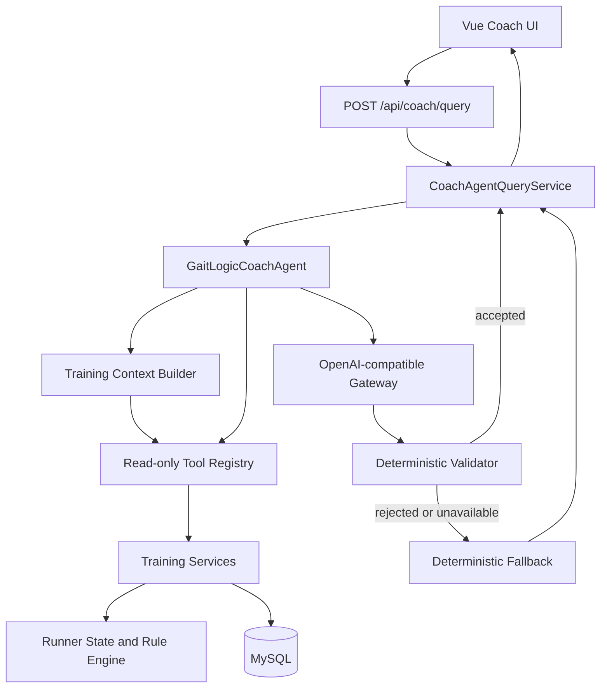

# GaitLogic Coach Agent Architecture v1

## 职责边界

- Vue 页面只发送公开问题、公开 Intent 和裁剪后的公开对话摘要。
- FastAPI 从认证上下文注入用户身份，客户端不能选择用户、Provider、模型或 Tool。
- Context Builder 通过八个只读工具预加载结构化事实。
- Tool Registry 校验输入输出 Schema，LLM 不直接访问数据库。
- Runner State 与规则引擎提供确定性事实和今日 Decision。
- Gateway 最多执行受限模型调用；Validator 阻止越权、虚构和覆盖规则的输出。
- Provider 关闭、失败或输出不合法时，Fallback 只复述已有规则和事实。

图中不包含 RAG、向量数据库、写工具、Weekly Review Agent、长期记忆、Streaming 或多 Agent，因为这些能力尚未实现。
