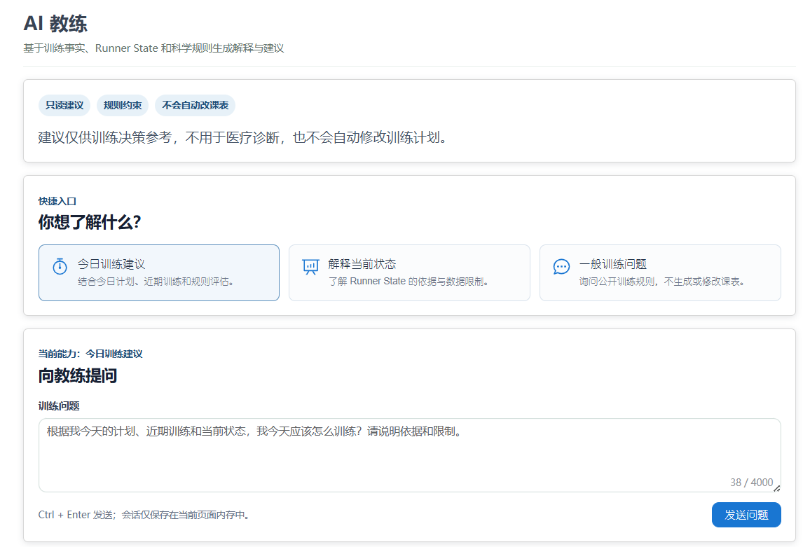
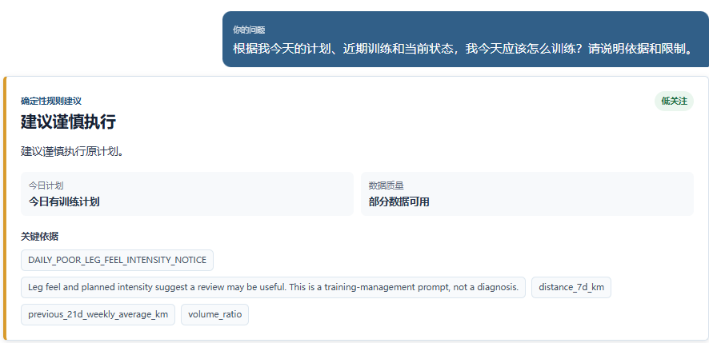
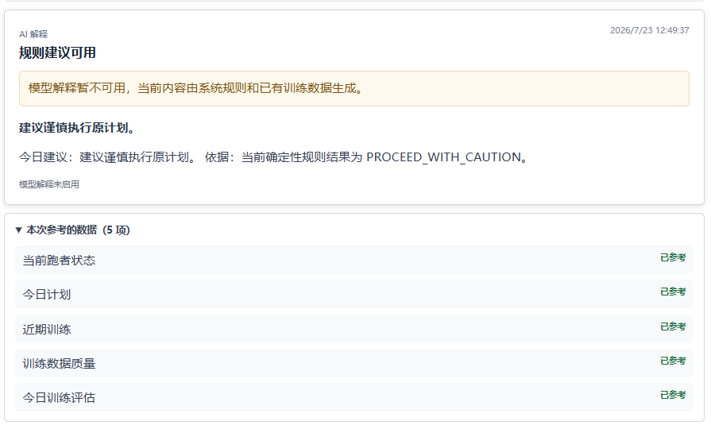
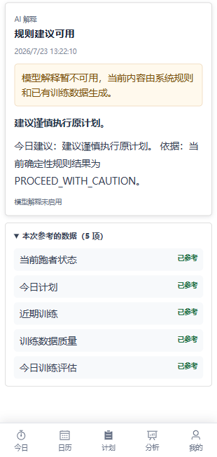

# Coach Agent 安全 Demo v1

## 数据边界

Demo 只能使用固定虚构用户和虚构训练数据。不要输入真实邮箱、手机号、Token、用户 ID、训练记录、Provider Key 或 Base URL。

## 启动后端

```powershell
Set-Location <repository>
python -m uvicorn server.main:app --reload
```

Provider 默认关闭：

```text
COACH_AGENT_ENABLED=false
COACH_AGENT_API_KEY=
```

此模式用于展示确定性 `DEGRADED` Fallback，不需要真实模型。

## 启动前端

```powershell
cd web
npm ci
npm run dev
```

登录本地虚构 Demo 账号后访问 `/coach`。不要在生产数据库创建演示数据。

## Mock / Fake Provider

自动测试使用进程内 `MockAgentLLMGateway` 和固定 Fixture，不访问网络。Demo 不提供公开 Mock API 路由；需要展示 Mock 成功态时，应在隔离测试环境使用浏览器请求拦截，完成后清除拦截。

## 推荐问题

```text
根据我今天的计划、近期训练和当前状态，我今天应该怎么训练？
```

```text
请解释我当前的 Runner State，以及哪些结论可能因为数据不足而不可靠。
```

## 演示顺序

1. 展示今日建议权威卡片先于模型回答；
2. 展示 HIGH Warning 或 UNKNOWN Limitation；
3. 展开“本次参考的数据”，确认只显示中文 Tool 名、状态和安全错误码；
4. 关闭 Provider，展示 `DEGRADED` 仍有确定性结果；
5. 刷新页面，确认内存会话被清空；
6. 确认没有修改训练计划按钮。

## 清理

关闭临时前后端进程和浏览器请求拦截。若使用一次性测试数据库，按测试环境流程删除；不要清理或覆盖产品工作区和真实数据。

## 截图

Coach Demo 使用固定测试或演示数据，自动测试不调用真实 Provider。Tool Summary 只展示中文工具名、状态和安全错误码，不展示参数或完整结果。

Runner State 和 Training Readiness 截图是项目负责人授权公开的产品使用截图，不包含账号身份、凭据或精确轨迹。

## Coach Overview



## Today Recommendation



## Deterministic Fallback



## Safe Tool Summary


