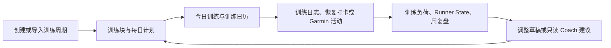

# 01｜项目全景与业务理解

## 一句话介绍

GaitLogic Planner 是面向严肃跑者的训练管理 Web 系统。它围绕“制定计划 → 执行训练 → 填写日志 → 数据复盘 → 调整计划”的闭环，帮助个人跑者把计划、客观活动数据、主观恢复反馈和可解释建议放在同一套系统中管理。

## 真实业务问题

跑者通常把训练计划、手表活动、主观感受、周期目标和复盘分散在多个工具中。只看设备数据容易忽略计划完成情况与主观负荷；只看课表又无法反映实际执行。项目的核心目标是把这些训练事实组织成可追踪、按用户隔离的训练过程，而不是做泛运动社交平台。

## 目标用户

- 有明确比赛或训练周期目标的个人跑者。
- 希望记录计划、实际训练、RPE、疼痛、恢复状态与周复盘的用户。
- 需要将 Garmin 活动导入并与计划/日志核对的跑者。

当前代码与文档没有提供真实活跃用户数量、留存或训练效果指标；这些不能在面试中被包装成已验证的业务成果。

## 核心业务闭环

其中“调整草稿”与“只读 Coach 建议”不能自动修改正式计划；用户确认仍是写入正式训练数据的边界。

## 主要模块

| 模块 | 解决的业务问题 | 当前状态 |
| --- | --- | --- |
| 认证与多用户隔离 | 确保每位跑者只看到自己的训练数据 | 已发布 |
| 训练周期、训练块、计划与日志 | 组织目标、周期与每天训练事实 | 已发布 |
| Excel/结构化导入 | 将符合系统规范的计划或训练记录导入为草稿或记录 | 已发布 |
| 今日训练、日历、Dashboard、周复盘 | 将计划与执行结果呈现并统计 | 已发布 |
| 配速规则与 VDOT | 保存配速档案与训练区间参考 | 已发布 |
| Training Readiness | 汇总恢复、负荷等信号，使用确定性模板表达建议 | 已发布 |
| Runner State | 聚合 7/28 天指标，保存可解释状态快照和历史趋势 | 已发布 |
| Garmin/Data Sync | 连接、任务、活动处理、训练日志关联与状态自动快照 | 已发布；真实登录仍依赖 Garmin SSO/MFA/网络 |
| Coach Agent | 用受限只读工具、确定性规则、Validator 和 Fallback 提供训练解释 | 已发布于 v0.11.0 |
| Training Knowledge Corpus | 提供可审计的训练知识文档、来源、Chunk 与 Manifest | v0.12.0 发布候选 |
| Embedding/Vector/Retriever | 建立受控索引与检索能力 | v0.12.0 发布候选 |
| RAG Agent Tool / RAG Eval | 将检索接入 Coach，生成可信引用并评测质量 | v0.12.0 发布候选 |

## 与普通训练记录工具的区别

1. 训练计划、实际日志、设备活动与周期状态处于同一业务模型中。
2. Runner State 与 Training Readiness 使用确定性计算和数据质量说明，不把训练结论直接交给模型猜测。
3. Garmin 同步不仅保存活动，还包含匹配、去重、复合活动、Material Change 与状态快照链路。
4. Coach Agent 不直接读写数据库，也不自动改课表；它通过严格 Schema 的只读工具获得事实。
5. RAG 采用来源、版权、Manifest root hash 与索引绑定设计，而不是直接把任意网页塞进向量库。

## 当前阶段与真实边界

### 发布候选：v0.12.0

v0.12.0 已完成受控 Corpus、OpenAI-compatible Embedding、Exact Cosine Index、Retriever、Coach 只读知识工具、Canonical Reference、前端引用、公开 Evaluation、Readiness 和真实 Provider Smoke。它仍不构成医疗诊断，不写训练计划、训练日志或 Runner State 快照；完成 release commit、合并和 Tag 后才算正式发布。

### 未完成或仅规划

- RAG 以外的 Weekly Review Agent、写工具、长期记忆、Streaming、多 Agent。
- Hybrid Retrieval、Reranker 和更大规模知识库。
- Docker 化、正式云基础设施和已验证生产 Nginx 配置。

## 面试时如何讲

推荐结构：先讲训练闭环，再讲“确定性事实与模型解释分离”，最后举 Garmin 同步或 Coach Agent 作为工程复杂度案例。不要先堆叠 FastAPI、LLM、RAG 等技术名词。

> 我做的是严肃跑者训练管理，不是通用聊天或运动社交。系统先把计划、日志、设备活动和恢复信息收拢成可追踪的训练事实；Runner State 和规则负责明确边界；Coach Agent 只在这些事实之上给出受限的解释与建议，不能自动改计划。

## 已知业务限制

- 不是医疗诊断或康复系统。
- Coach 当前只读，不自动调整计划。
- Garmin 真实登录与同步受外部 SSO、区域、MFA、限流和网络条件影响。
- 公开仓库不能包含真实用户训练数据、令牌、私有竞赛参数或实验结果。
- 尚未证明真实线上规模、留存、训练效果或模型带来的业务指标。

## 证据入口

- `README.md`
- `docs/更新历史.md`
- `planner_core/database/models.py`
- `server/main.py`
- `docs/training-knowledge/`
- `docs/agent/`
- `docs/rag/`
