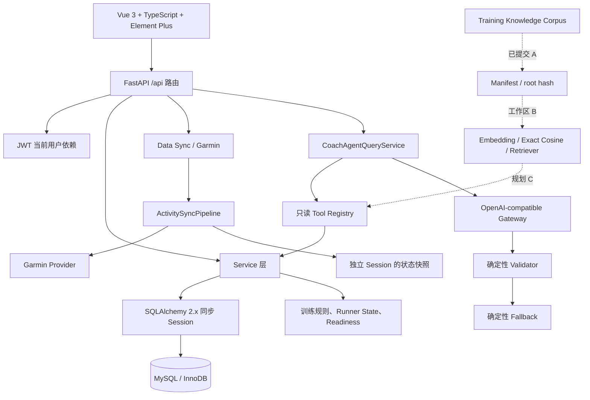

# 02｜系统架构与核心调用链

## 架构概览



虚线代表尚未形成发布能力的 RAG 路径。当前 Retriever 没有注册为 Agent Tool。

## 目录职责

| 位置 | 职责 |
| --- | --- |
| `planner_core/` | 配置、数据库 Base/Session/模型、通用枚举、训练知识规则核心 |
| `server/api/routes/` | FastAPI 路由与请求入口 |
| `server/services/` | 面向业务的查询、聚合、事务与编排服务 |
| `server/domain/` | 领域规则配置和规则模型 |
| `server/integrations/` | 外部 Provider、Data Sync Pipeline 与适配器 |
| `server/agent/` | Tool、上下文、Provider Gateway、编排、Validator、Fallback、Evaluation |
| `server/knowledge_retrieval/` | Corpus、索引、Embedding、向量检索代码；B 部分仍在工作区 |
| `knowledge/` | 可审计训练知识文档、来源、分类和 Manifest |
| `web/` | Vue 前端、Axios API Client、Router、视图与 Vitest 测试 |
| `tests/` | pytest 单元、接口、集成和安全边界测试 |
| `scripts/` | 初始化、升级、部署、检查和知识构建 CLI |

## 请求链路一：Coach 查询

入口：`POST /api/coach/query`。

```text
CoachAgentView
  → web API client
  → server/api/routes/coach.py::query_coach
  → 当前认证用户 get_current_user
  → CoachAgentQueryService.query(user_id, payload)
  → 创建 AgentRequest，并由服务端注入 user_id
  → Tool dependencies / Tool Registry / Training Context Builder
  → GaitLogicCoachAgent.run
  → OpenAI-compatible Gateway（Provider 开启时）
  → 严格 Pydantic 输出校验 + Deterministic Validator
  → CoachQueryResponse
  → 若 Provider 或校验不能安全完成：DeterministicCoachFallback
```

关键边界：客户端不能提交 `user_id`、Provider、模型、Base URL、API Key、Prompt 或 Tool Schema；Tool Registry 只允许 `read_only` 且与 Intent 匹配的工具；模型不能覆盖 TODAY 的权威训练事实。

相关文件：

- `server/api/routes/coach.py`
- `server/services/coach_agent_query_service.py`
- `server/agent/orchestrator.py`
- `server/agent/registry.py`
- `server/agent/validator.py`
- `server/agent/providers/openai_compatible.py`
- `server/agent/fallback.py`

## 请求链路二：Garmin 同步到状态快照

```text
数据同步路由或后台入口
  → 创建 ExternalSyncJob
  → ActivitySyncPipeline.run_job(Session A, job_id)
  → garmin_sync_service.run_sync_job
  → 原始活动/规范化活动/匹配/WorkoutLog 处理
  → Session A 提交训练事实
  → GarminSyncRunOutcome（含 sync_run_id、claimed、committed、material change）
  → Pipeline 新建独立 Session B
  → RunnerStateAutoSnapshotService.process_garmin_sync_outcome
  → 状态快照或触发回执
  → 自动快照失败返回 FAILED_NON_BLOCKING，不回滚同步主事务
```

事务隔离的原因：训练事实提交成功后，状态快照只是后置能力；快照失败不能把已成功的 Garmin 同步回滚掉。

相关文件：

- `server/integrations/activity_sync/pipeline.py`
- `server/services/garmin_sync_service.py`
- `server/integrations/activity_sync/outcome.py`
- `server/workers/external_sync_worker.py`
- `server/services/runner_state_auto_snapshot_service.py`
- `server/services/runner_state_snapshot_receipt_query_service.py`

## 请求链路三：Training Knowledge Corpus 到 Retriever

### 已提交的 A 阶段

```text
knowledge/documents + sources + taxonomy
  → KnowledgeCorpusLoader
  → 确定性 Chunker
  → Validator
  → corpus-v1.json Manifest
  → corpus root hash
```

### 工作区中的 B 阶段

```text
Corpus Manifest
  → Embedding Provider（默认关闭、服务端配置）
  → Index Manifest + Exact Cosine Vector Store
  → TrainingKnowledgeRetriever
  → 结果携带 chunk/source/version 引用
```

### 规划中的 C 阶段

将 Retriever 包装为只读 `retrieve_training_knowledge` Tool，并保持“知识解释不能覆盖用户训练事实或确定性建议”。该链路目前不能写成已实现。

## 数据层架构

`planner_core/database/session.py` 使用 SQLAlchemy `create_engine` 和同步 `SessionLocal`；`get_session()` 只负责获取和关闭 Session。业务服务明确承担 commit、rollback、幂等和异常语义。

核心模型包括：

- `UserAccount`
- `TrainingCycle`、`TrainingBlock`、`PlannedWorkout`、`WorkoutLog`
- `ExternalAccountConnection`、`ExternalSyncJob`、`ExternalActivity`、`WorkoutLogExternalActivity`
- `DailyRecoveryCheckin`、`TrainingReadinessAssessment`
- `RunnerStateSnapshotRecord`、`RunnerStateSnapshotTriggerReceipt`
- `TrainingKnowledgeItem`、`TrainingRule` 及其审计/版本/证据关联模型

## 已知架构问题与学习点

1. 同步 Session 适合现有服务结构，但长时外部请求与 Worker 并发需要谨慎控制连接生命周期。
2. 项目不使用 Alembic；表结构以 `sql/schema.sql`、初始化脚本和版本升级脚本共同维护，迁移纪律要求更高。
3. Garmin 通用 Pipeline 已建立，但活动处理核心仍有一部分委托旧 Garmin Service，尚处于渐进式抽象。
4. RAG B 目前使用本地 Exact Cosine Store，适合可审计与测试，不等同于生产级向量数据库方案。
5. Docker、正式 Nginx 配置和云基础设施没有仓库证据，应作为后续生产化工作。

## 面试提示

不要把架构图讲成“模型直接查数据库”。应强调三层责任：结构化训练服务提供事实、规则服务提供决策边界、受限模型负责解释；再说明 Validator/Fallback 如何让模型异常不演变为训练数据写入或不安全承诺。
