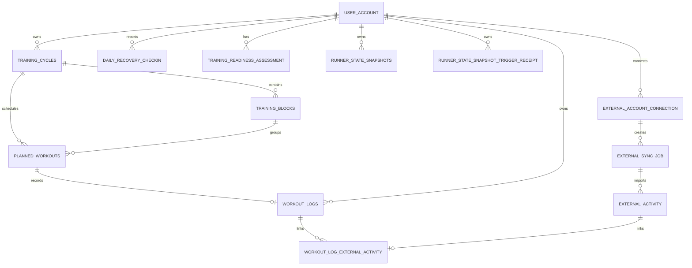

# 03｜核心数据模型与数据库设计

## 设计目标

GaitLogic 的数据库不是单纯的“跑步记录表”。它要同时表达训练计划、实际执行、周期归属、恢复反馈、外部活动、规则解释和历史状态，并保证每位用户只能读取和修改自己的数据。

当前实现使用 MySQL、InnoDB、`utf8mb4` 与 SQLAlchemy 2.x 同步 ORM。主键统一由 `IdMixin` 提供 `BIGINT` 自增 `id`；多数业务表通过 `TimestampMixin` 使用 MySQL `TIMESTAMP` 的创建/更新时间默认值。

证据：

- `planner_core/database/base.py`
- `planner_core/database/models.py`
- `planner_core/database/session.py`
- `sql/schema.sql`
- `scripts/init_db.py`

## 核心关系图



这张图只列出训练闭环与同步主路径；规则治理、AI 草稿、导入审计、配速档案、反馈等模型在后续功能文档中继续展开。

## 训练计划与执行模型

| 模型 | 关键职责 | 关键约束 / 索引 | 设计意义 |
| --- | --- | --- | --- |
| `UserAccount` | 身份、角色与用户数据根节点 | `username`、`email` 唯一 | 所有用户数据的隔离锚点 |
| `TrainingCycle` | 一段训练周期、目标比赛与生命周期 | `uq_training_cycles_one_active_per_user`、`(user_id, status)` | 同一用户最多一个 active 周期 |
| `TrainingBlock` | 周或阶段级训练块 | `(cycle_id, sort_order)` 唯一 | 维持周期内稳定排序 |
| `PlannedWorkout` | 每日计划训练，可支持同日多练 | `(cycle_id, workout_date, session_index)` 唯一 | 避免同周期同日同序号重复课表 |
| `WorkoutLog` | 实际训练、主观反馈、客观指标和来源 | `planned_workout_id` 唯一、用户/日期索引、活动指纹索引 | 一堂计划默认对应一份日志，同时支持计划外训练 |

### 为什么 `PlannedWorkout` 与 `WorkoutLog` 分表

计划是“应该做什么”，日志是“实际做了什么”。它们分表后可以保留计划原貌，记录跳过、调整、计划外训练和来自 Garmin 的客观数据，也能支持完成率、计划偏差和后续调整草稿。

`WorkoutLog.planned_workout_id` 是可空外键，允许计划外训练；但一个已计划训练通过 `uq_workout_logs_planned_workout` 最多关联一份日志。这个约束不是“每位用户每天只能跑一次”，因为同日多练由 `session_index` 区分。

### 训练数据中的缺失与零值

训练距离、时长、RPE、心率等大量字段可为空。空值表示未收集或不可靠，不能自动当成 0；这直接影响 Runner State 的数据质量与覆盖率计算。数值距离使用 `Numeric`/`Decimal`，避免浮点累计误差被悄悄带入统计。

## 用户隔离策略

### 数据库层

多数领域表含 `user_id` 外键，通常 `ON DELETE CASCADE`；如训练日志关联的计划或周期被移除时，部分外键使用 `SET NULL` 以保留历史训练事实。查询索引常以 `user_id` 为首列，例如：

- `ix_workout_logs_user_cycle_date`
- `ix_external_sync_job_user_created`
- `ix_runner_state_snapshots_user_cutoff`
- `ix_daily_recovery_user_date`

### 应用层

受认证保护的 API 从当前 JWT 用户上下文取身份，而不是接受客户端 `user_id`。服务查询还需使用当前用户作为 WHERE 条件；仅有数据库外键不足以阻止“知道别人的记录 ID 后越权读取”。

面试时应说明：`user_id` 同时是数据归属、查询范围和索引前缀；鉴权依赖必须与服务层过滤共同存在。

## Garmin 与外部活动模型

| 模型 | 用途 | 一致性设计 |
| --- | --- | --- |
| `ExternalAccountConnection` | 外部账号连接及加密令牌载体 | 活跃用户/provider 与活跃账号键都有限制，避免同账号重复绑定 |
| `ExternalSyncJob` | 异步同步任务、重试与统计 | `(connection_id, idempotency_key)` 唯一；`sync_run_id` 支持逻辑运行身份 |
| `ExternalActivityRaw` | 脱敏原始活动暂存 | provider、外部活动 ID、payload hash 唯一 |
| `ExternalActivity` | 规范化外部活动 | provider + external_activity_id 唯一，按用户/日期/状态查询 |
| `WorkoutLogExternalActivity` | 日志与活动的关联 | 关联对唯一，单条活动默认只能进入一个日志 |
| `ExternalActivityResolution` | 用户或系统对活动匹配结果的处理记录 | 保存复核/忽略/关联的审计线索 |

Garmin 处理不应通过“重复调用 API 是否报错”判断幂等，而是通过数据库唯一约束、外部 ID、payload hash、Job idempotency key 和 `sync_run_id` 的组合实现可重试语义。

## Runner State、快照与回执

### 快照记录

`RunnerStateSnapshotRecord` 对应表 `runner_state_snapshots`。它保存：

- 业务日期、数据截止日、计算时间和创建时间；
- 触发类型、Schema 版本、规则版本；
- 查询摘要字段，如 7/28 天距离、状态、风险数量、Evidence 覆盖率；
- 完整 JSON payload 和 SHA-256 `payload_hash`。

唯一约束 `uq_runner_state_snapshot_user_cutoff_hash(user_id, data_cutoff_date, payload_hash)` 的意义是：同一用户、同一截止日期、同一语义状态只保存一次；同日发生实际状态变化仍可产生新的快照。

### 自动触发回执

`RunnerStateSnapshotTriggerReceipt` 记录自动快照触发的处理状态、快照 ID、同步任务 ID、变化数量、处理租约和安全错误码。唯一约束：

```text
(user_id, trigger_type, trigger_reference)
```

它让同一 Garmin 逻辑同步重试可以共享处理结果，避免重复创建快照。回执中的 `processing_token`、锁定时间、尝试次数和安全错误信息属于内部字段，不应直接暴露给客户端。

## 事务边界

### 普通训练写入

训练周期、计划和日志服务在完成校验后调用 `db.commit()`；失败时服务需要 rollback，避免 Session 带着失败事务继续服务后续请求。

### Garmin 主事务与快照后置事务

```text
Session A: 领取同步 Job → 保存/更新活动与 WorkoutLog → commit
Session B: 根据 Outcome 创建或查询自动状态快照 → commit/rollback/close
```

`ActivitySyncPipeline` 显式创建独立的快照 Session。Session B 出现异常时返回 `FAILED_NON_BLOCKING`，不能回滚 Session A，也不能改写 Garmin Job 已完成的终态。

### 并发与唯一约束

应用层的“先查询后插入”不足以应对并发。快照服务需要捕获唯一约束冲突、rollback 并重新查询已有记录；自动快照服务还使用嵌套事务处理可预期的竞争。数据库约束是最终裁决者，应用代码负责把冲突转换为合理的幂等结果。

## 迁移与 Schema 同步

项目当前不使用 Alembic。存在三个层面：

1. `planner_core/database/models.py`：ORM 的当前结构。
2. `sql/schema.sql`：全新数据库的建表基线。
3. `scripts/upgrade_v*.py`：已有数据库的版本升级与降级步骤。

v0.10.3 的顺序必须是：

```text
runner_state_snapshots
→ garmin_sync_material_change
→ runner_state_snapshot_receipts
```

回滚必须严格反序。快照表升级脚本用 `checkfirst=False`，重复运行应该失败，以暴露错误的部署流程而不是伪装成功；Garmin Material Change 脚本要求 MySQL，并对历史 Job 回填 `sync_run_id`。

### 当前风险

- ORM、`sql/schema.sql` 和升级脚本存在三处维护点，任何一处遗漏都会造成新库与升级库不一致。
- `Base.metadata.create_all()` 适合初始化，但不能代替受控的生产升级顺序。
- MySQL 对部分 `CHECK` 约束的实际执行能力受版本影响；关键业务规则不能只依赖数据库 Check。

## 关键索引为什么这样设计

| 索引/约束 | 主要查询或风险 | 为什么必要 |
| --- | --- | --- |
| `uq_training_cycles_one_active_per_user` | 切换当前训练周期 | 防止同一用户出现两个 active 周期 |
| `(cycle_id, workout_date, session_index)` | 日历与同日多练 | 支持唯一定位计划训练 |
| `ix_workout_logs_user_activity_date` | 用户近期训练统计 | 使按用户和自然日窗口聚合可索引 |
| `(connection_id, idempotency_key)` | 重复创建同步任务 | 将客户端/服务端重试收敛为同一 Job |
| `(provider, external_activity_id)` | 重复同步同一活动 | 以 Provider 事实 ID 防重复 |
| `uq_runner_state_snapshot_user_cutoff_hash` | 重复状态快照 | 提供内容级幂等 |
| `(user_id, trigger_type, trigger_reference)` | 自动快照重试 | 一次逻辑触发只保留一个回执 |

## 常见面试追问

1. 为什么既有 `user_id` 外键又在子表重复保存 `user_id`？
2. 为什么 WorkoutLog 对 PlannedWorkout 是一对一，但 ExternalActivity 又经关联表连接？
3. 你如何区分缺失 RPE 和 RPE=0？
4. 如果两个 Worker 同时处理一个同步 Job 或快照，结果会怎样？
5. 为什么要保存完整 Snapshot Payload，也要冗余保存摘要列？
6. 没有 Alembic 时如何避免迁移漂移？
7. `create_all()` 为什么不适合上线时替代迁移？

## 当前掌握程度自检

完成本章后，应能够：

- 画出训练计划、日志、Garmin 活动和状态快照的关系。
- 解释三个关键唯一约束和三个关键索引。
- 说明 Session A/B 的边界与失败隔离。
- 解释“数据库约束是最终幂等裁决”的含义。
- 指出当前迁移机制的维护风险，而不是只说“用了 MySQL”。
