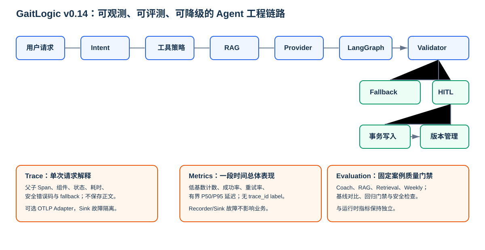

# v0.14.0 总览：Agent 工程化

v0.14 不增加新的训练决策或写工具。它把既有 Coach、训练知识检索、Weekly Review、HITL 与计划版本能力，补齐为可观测、可评测、可安全降级的工程系统。

- Trace 解释某一次请求的安全执行路径。
- Metrics 汇总一段时间的计数、成功率、重试与延迟分位数。
- Evaluation 在固定虚构案例上检查质量、安全和回归。
- Reliability 用统一 Provider Failure Taxonomy 约束超时、重试、退避与 Fallback。

这四层都只使用低风险元数据；不保存用户问题、Prompt、训练正文、Provider 原始响应、凭据、向量或身份信息。
