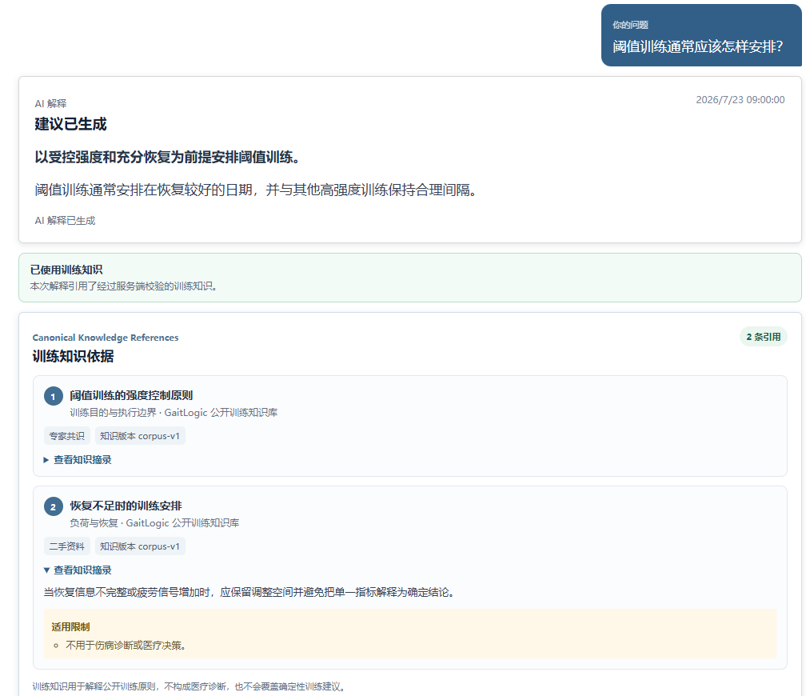
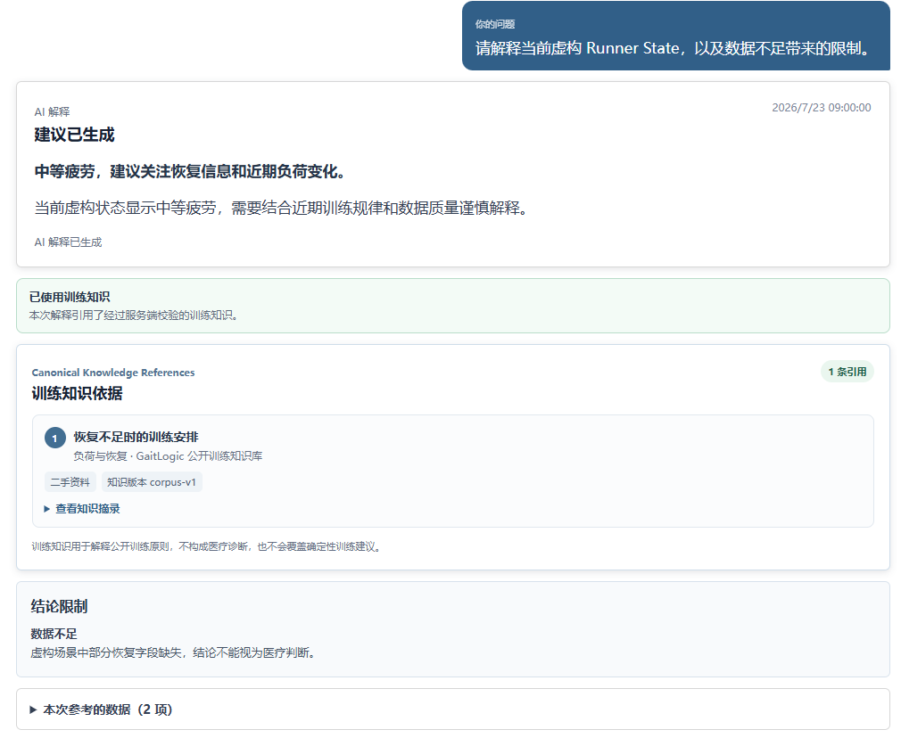
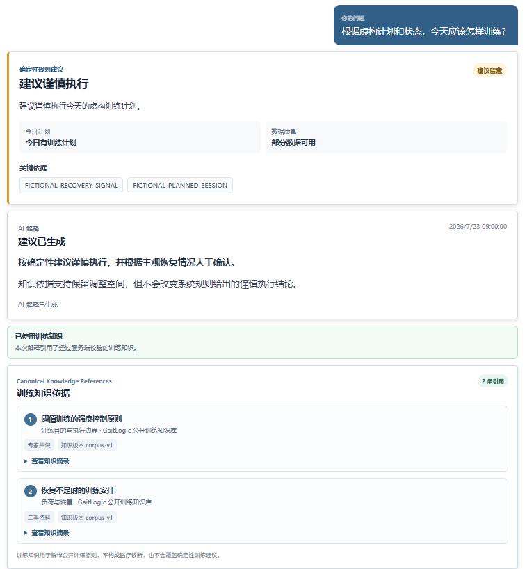
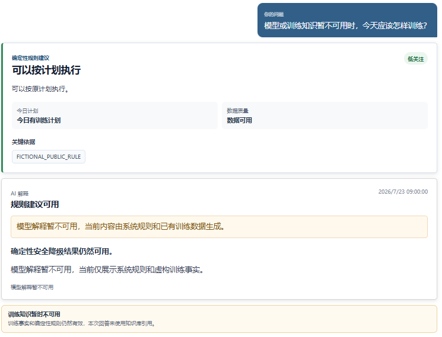

# Training Knowledge Alpha Demo v1

## 数据边界

四个 Demo 使用固定虚构问题、虚构训练状态和公开知识摘录，不使用真实账号、训练日志、GPS、Provider Key、Provider 原始回答或生产数据库。

## 场景

开发环境在登录后可使用以下固定入口；`demo` 参数只选择公开虚构 Fixture，不保存问题、不绕过认证，也不调用真实 Provider：

- `/coach?demo=general`
- `/coach?demo=explain`
- `/coach?demo=today`
- `/coach?demo=degraded`

### GENERAL

问题：阈值训练通常应该怎样安排？

页面展示 AI 解释、两条训练知识引用，以及“未使用个人训练数据”的 limitation。截图：`docs/assets/coach-agent/coach-rag-general.png`。

### EXPLAIN

使用虚构的中等疲劳和部分数据可用状态，展示 Runner State 解释、恢复知识引用和数据限制。截图：`docs/assets/coach-agent/coach-rag-explain.png`。

### TODAY

权威卡片固定为 `PROCEED_WITH_CAUTION / PLANNED / MODERATE`。两条训练知识引用在 AI 解释之后展示，不能改变 Decision；Warning 和数据限制继续保留。截图：`docs/assets/coach-agent/coach-rag-today.png`。

### DEGRADED

模拟 Provider 或 Knowledge Retrieval 不可用。页面保留确定性 Fallback，显示友好状态，不展示伪造引用或底层错误。截图：`docs/assets/coach-agent/coach-rag-degraded.png`。

## 验收

1. TODAY 卡片始终位于模型解释和引用之前；
2. GENERAL 不出现 TODAY 卡片；
3. 引用区不显示内部 ID、路径、分数、向量或 Provider；
4. DEGRADED 没有伪造引用；
5. 桌面和移动视口没有横向溢出；
6. 页面明确声明不构成医疗诊断，也不会自动修改训练计划。

## 当前限制

这是 Alpha 展示，不代表私有 Retrieval 标签确认和人工盲评已经完成。公开产品不包含竞赛评测数据、失败案例或私有实验参数。
